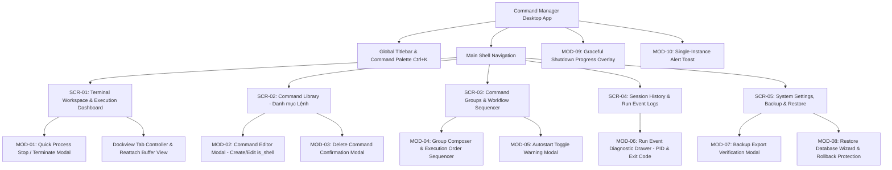
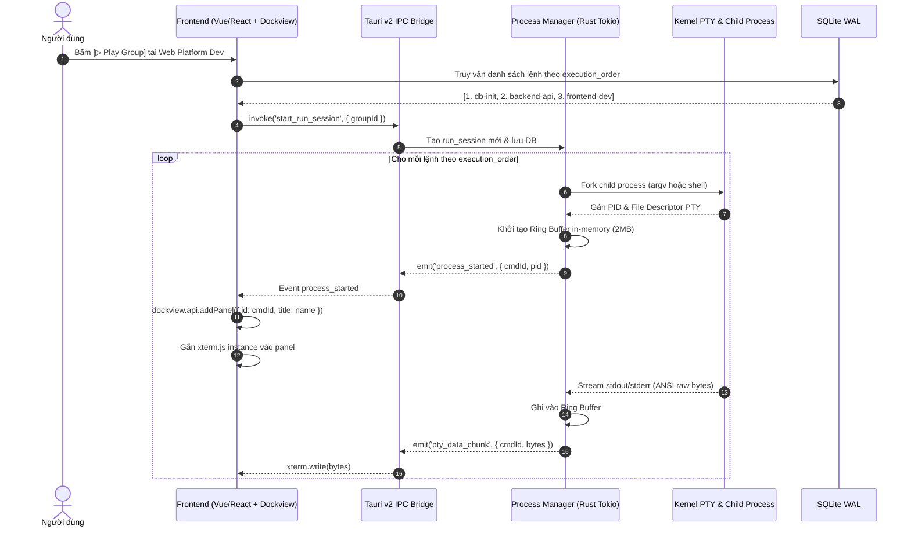
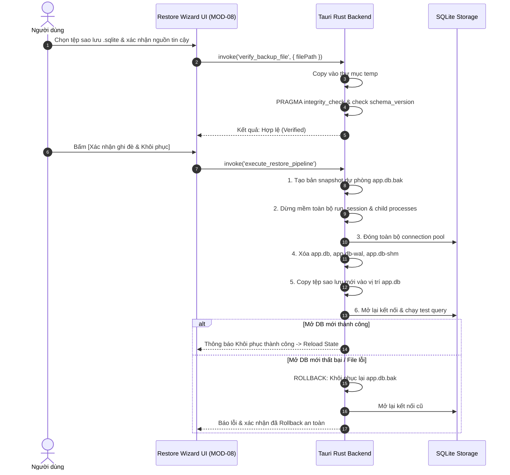

# Tài liệu Thiết kế Giao diện và Trải nghiệm Người dùng (UI/UX Screen Design Specification)

> **Dự án:** Ứng dụng Desktop Quản lý, Thực thi Lệnh và Terminal Đa nhiệm (Command Manager Desktop)  
> **Tài liệu tham chiếu:** [plan.md](./plan.md) | [checklist.md](./checklist.md)  
> **Nền tảng mục tiêu:** Tauri v2 (Rust Backend + Vite/TypeScript Frontend + SQLite WAL + PTY xterm.js + Dockview)

---

## 1. Nguyên tắc Thiết kế & Kiến trúc Giao diện Tổng thể

### 1.1. Triết lý Thiết kế (Design Principles)
1. **Developer-First & Information-Dense:** Giao diện tối ưu hóa cho lập trình viên, sysadmin và DevOps; mật độ thông tin cao nhưng gọn gàng, giảm thiểu các khoảng trống vô nghĩa, ưu tiên hiển thị trạng thái lệnh và luồng terminal.
2. **Trạng thái Trực quan Thời gian thực (Real-time Observability):** Mỗi lệnh và nhóm lệnh phải phản ánh tức thì trạng thái thực tế: *Idle / Ready*, *Running (kèm PID tạm & thời gian chạy)*, *Success (Exit code 0)*, *Failed (Exit code != 0)*, *Terminating*.
3. **Phân định Rõ ràng: Đóng Tab ≠ Hủy Tiến trình:** Thiết kế UI phải thể hiện rõ hợp đồng vòng đời: Đóng tab terminal chỉ ẩn giao diện hiển thị, tiến trình vẫn chạy ngầm trong backend. Nút "Stop" đỏ và hành động thoát ứng dụng mới kích hoạt quy trình Graceful Shutdown.
4. **Dark Mode Chủ đạo (Terminal Aesthetic):** Bảng màu tối chuẩn hiện đại (Slate/Zinc pha tím than), độ tương phản cao đạt chuẩn WCAG AA, phông chữ đơn cách (Monospace) chất lượng cao (JetBrains Mono / Fira Code) cho mọi chuỗi lệnh và màn hình terminal.
5. **Bảo vệ Vùng Tin cậy (Trusted Zone & Safe Fallback):** Các tác vụ đặc quyền (sửa chuỗi lệnh, nhập bản sao lưu đè DB, kích hoạt autostart) luôn có cờ cảnh báo rõ ràng và bước xác nhận an toàn.

---

### 1.2. Bố cục Khung Ứng dụng (App Shell Architecture)

Cấu trúc cửa sổ tuân thủ mô hình chuẩn của một Desktop IDE/Workstation hiện đại:

```
+-----------------------------------------------------------------------------------------------+
| [Icon] Command Manager v0.1.0        [Search Commands / Groups... Ctrl+K]      [_] [□] [X]    | <- Custom Titlebar
+-----------------------------------------------------------------------------------------------+
| NAV   | SUB-SIDEBAR       | MAIN WORKSPACE (Dockview Tabs & Content)                         |
| BAR   | (Groups / Tree)   |                                                                  |
| (64px)| (260px)           | +--------------------------------------------------------------+ |
|       |                   | | [Tab 1: API Server (PID: 1042)] [x] | [Tab 2: Web Dev] [x] | + | | <- Tab Bar
| [DSH] | > Active Sessions | +--------------------------------------------------------------+ |
| [CMD] |   ● Web Stack (2) | $ npm run dev -- --host                                        | |
| [GRP] |     ├─ vite (run) | VITE v5.4.2  ready in 280 ms                                   | |
| [LOG] |     └─ api  (run) | ➜  Local:   http://localhost:5173/                             | |
|       |                   | ➜  Network: http://192.168.1.15:5173/                          | |
|       | > Quick Launch    |                                                                | |
|       |   [▷ Run All]     |                                                                | |
|       |   [⏹ Stop All]    |                                                                | |
| ----- |                   |                                                                | |
| [SET] | [Autostart: ON]   |                                                                | |
+-----------------------------------------------------------------------------------------------+
| [STATUS BAR] ● 2 running | Ring Buffer: 420KB/2MB | SQLite: WAL | Single-Instance: Locked     |
+-----------------------------------------------------------------------------------------------+
```

* **Custom Titlebar (40px):** Tích hợp vùng kéo thả cửa sổ (`data-tauri-drag-region`), logo, thanh tìm kiếm nhanh toàn cục (Command Palette / Quick Jump `Ctrl+K`), nút thu nhỏ/phóng to/đóng với logic can thiệp sự kiện Close để thực hiện Graceful Shutdown.
* **Activity Bar / Nav Rail (60px):** Cố định bên trái với các biểu tượng điều hướng màn hình chính:
  * 🖥️ **Dashboard & Workspace (`/workspace`):** Không gian quản lý phiên chạy và Tabs Terminal.
  * ⚡ **Command Library (`/commands`):** Thư viện lệnh, cấu hình argv/shell.
  * 📁 **Groups & Workflows (`/groups`):** Quản lý nhóm lệnh và thứ tự thực thi (`execution_order`).
  * 📜 **Session History & Logs (`/history`):** Lịch sử các `run_session` và sự kiện `run_event`.
  * ⚙️ **Settings & Backup (`/settings`):** Cấu hình Autostart, dung lượng Buffer, Sao lưu & Khôi phục SQLite.
* **Side Panel (Collapsible 260px):** Hiển thị danh sách ngữ cảnh tùy thuộc vào màn hình được chọn (ví dụ: Cây nhóm lệnh và trạng thái phiên chạy ở Workspace).
* **Main Content Area (Fluid):** Khu vực hiển thị linh hoạt với Dockview (hỗ trợ tab đa nhiệm và tương lai chia lưới Split View).
* **Global Status Bar (28px):** Thanh trạng thái kỹ thuật chân trang: số lượng tiến trình đang chạy, dung lượng ring buffer đang chiếm dụng, trạng thái kết nối SQLite WAL, cờ Autostart.

---

## 2. Bản đồ Màn hình & Cấu trúc Điều hướng (Screen Sitemap)



---

## 3. Thiết kế Chi tiết Từng Màn hình (Screen Specifications)

---

### Màn hình 1: SCR-01 — Terminal Workspace & Execution Dashboard

#### 1. Mục đích & Vai trò
Màn hình trung tâm hàng ngày của người dùng. Cho phép kích hoạt chạy theo nhóm hoặc từng lệnh riêng lẻ, giám sát trực quan các terminal PTY qua các thẻ tab dockview, xem log đầu ra gần đây từ ring buffer và kiểm soát vòng đời tiến trình.

#### 2. Wireframe Chi tiết

```
+----------------------------------------------------------------------------------------------------+
| [=] Workspace   | Active Session: Web Platform Dev (Started 14:20:05)      [⏹ Stop Group] [▷ Restart]|
+-----------------+----------------------------------------------------------------------------------+
| GROUPS TREE     | [xterm] frontend (PID: 2841) [x] | [xterm] backend-api (PID: 2845) [x] | [+] New Tab|
| Search groups.. |----------------------------------------------------------------------------------+
| v Web Platform  | [Actions: 🔄 Reattach Buffer | ⎚ Clear | 🗖 Maximize | ⏹ Stop Process (SIGTERM) ]  |
|   [▷] [⏹] [Aut] |----------------------------------------------------------------------------------+
|   ● 01. db-init | $ pnpm run dev                                                                   |
|     (Code: 0)   |                                                                                  |
|   ● 02. backend |   VITE v5.4.2  ready in 340 ms                                                   |
|     (PID: 2845) |                                                                                  |
|   ● 03. frontend|   ➜  Local:   http://localhost:5173/                                             |
|     (PID: 2841) |   ➜  Network: http://192.168.1.15:5173/                                          |
|                 |   ➜  press h + enter to show help                                                |
| > Microservices |                                                                                  |
|   [▷] [⏹]       |                                                                                  |
|   ○ 01. redis   |                                                                                  |
|   ○ 02. worker  |                                                                                  |
|                 |                                                                                  |
| > Standalone    |                                                                                  |
|   ▷ cloudflared |                                                                                  |
|   ▷ backup-job  |                                                                                  |
+-----------------+----------------------------------------------------------------------------------+
| Active: 2 cmds  | xterm: 120x34 | Encoding: UTF-8 | PTY Stream: Connected | Memory Buffer: 128KB     |
+----------------------------------------------------------------------------------------------------+
```

#### 3. Các Thành phần Giao diện & Data Binding
* **Left Sub-Sidebar: Execution Explorer (Tree View):**
  * Danh sách phân cấp: `command_group` -> `group_membership` -> `command_definition`.
  * Hiển thị số thứ tự `execution_order` (ví dụ: `01.`, `02.`).
  * Trạng thái trực tiếp của từng node:
    * ⚪ **Idle (Xám):** Chưa chạy trong phiên hiện tại.
    * 🟡 **Starting (Vàng nhấp nháy):** Backend đang fork tiến trình và phân bổ PTY.
    * 🟢 **Running (Xanh lá sáng kèm spinner):** Đang chạy, hiển thị tooltip PID hiện hành.
    * 🔵 **Completed (Xanh dương):** Tiến trình đã hoàn thành với exit code = 0.
    * 🔴 **Failed (Đỏ):** Tiến trình dừng với exit code != 0.
  * Nút tác vụ nhanh trên đầu nhóm:
    * **Play Button (`▷`):** Kích hoạt `run_session` mới, khởi chạy các lệnh theo `execution_order`. Tự động thêm tab tương ứng (`dockview.api.addPanel()`).
    * **Stop Button (`⏹`):** Gửi tín hiệu dừng cho toàn bộ các lệnh đang chạy thuộc nhóm đó.
* **Main Area: Dockview Tabbed PTY Terminals:**
  * **Header Tab Strip:**
    * Tên tab tương ứng `command_definition.name`.
    * Dot màu trạng thái (Xanh = Running, Xám = Stopped, Đỏ = Crashed).
    * Badge hiển thị PID (ví dụ: `PID: 2841`).
    * Nút đóng tab `[x]`: Click vào đây sẽ **chỉ ẩn tab khỏi dockview**, KHÔNG hủy tiến trình backend (hiển thị tooltip nhắc nhở: *"Ẩn tab terminal. Lệnh vẫn tiếp tục chạy ngầm"*).
    * Nút `[+]`: Mở menu chọn lệnh độc lập để khởi chạy trong tab mới.
  * **Terminal Toolbar (Thanh công cụ trên đầu mỗi viewport):**
    * Nút **Stop Process (`⏹`):** Dừng tiến trình hiện hành của tab (gửi SIGTERM / TerminateProcess).
    * Nút **Restart Process (`🔄`):** Khởi động lại lệnh hiện tại.
    * Nút **Reattach / Flush Buffer:** Xả lại 1MB/2MB byte gần nhất từ Ring Buffer trong bộ nhớ lên xterm.js nếu màn hình bị mất sync.
    * Nút **Clear Screen (`⎚`):** Xóa màn hình xterm.js cục bộ (không ảnh hưởng ring buffer).
    * Nút **Copy All Output:** Sao chép nội dung log đang hiển thị.
  * **xterm.js Canvas Container:**
    * Tự động resize listener (`FitAddon`): Bắt sự kiện resize của tab và gửi thông số `cols` và `rows` xuống kernel PTY qua Tauri IPC để đồng bộ kích thước dòng lệnh chuẩn xác.
    * Hỗ trợ đầy đủ mã màu ANSI 256 / Truecolor, font ligature, chuột click link URL.

#### 4. Các Trạng thái Giao diện (UI States)
* **Empty State:** Chưa có nhóm hoặc lệnh nào chạy: Hiển thị minh họa đồ họa, thông điệp *"Không có phiên chạy nào đang mở. Chọn một nhóm lệnh từ danh sách bên trái hoặc nhấn Play để bắt đầu"*.
* **Reattaching State:** Khi người dùng mở lại một tab đã bị đóng trước đó: Hiển thị spinner nhẹ *"Đang kết nối lại PTY & xả dữ liệu từ bộ nhớ đệm..."* trước khi xterm render lại nội dung.
* **Process Exit State:** Khi tiến trình kết thúc (dù thành công hay thất bại), xterm vẫn giữ nguyên nội dung kèm một thông báo thanh mảnh ở góc trên terminal: `[Process exited with code 0 - Press Enter or Click Restart to rerun]`.

---

### Màn hình 2: SCR-02 — Quản lý Thư viện Lệnh (Command Library)

#### 1. Mục đích & Vai trò
Nơi định nghĩa, cấu hình và quản trị toàn bộ các câu lệnh độc lập (`command_definition`). Quản lý cách thức thực thi rõ ràng: Chạy trực tiếp qua mảng đối số (argv) hay qua vỏ lệnh (shell), bảo vệ tính toàn vẹn của chuỗi thực thi.

#### 2. Wireframe Chi tiết

```
+----------------------------------------------------------------------------------------------------+
| [=] Command Library      [🔍 Search commands by name, string...]   [Filter: All / Shell / Argv]   |
|                          [+ Tạo Lệnh Mới]  [Import Command]                                        |
+----------------------------------------------------------------------------------------------------+
| TÊN LỆNH          | KIỂU THỰC THI | CHUỖI LỆNH (EXECUTION STRING)           | NHÓM THUỘC VỀ | HÀNH ĐỘNG    |
|-------------------+---------------+-----------------------------------------+---------------+--------------|
| Vite Frontend Dev | [Shell: bash] | pnpm --filter web dev --port 3000       | Web Platform  | [▷] [✎] [⧉] [🗑] |
| NestJS Backend API| [Direct Argv] | node dist/main.js --env=local           | Web Platform  | [▷] [✎] [⧉] [🗑] |
| Docker PostgreSQL | [Shell: sh]   | docker compose up -d postgres           | Infrastructure| [▷] [✎] [⧉] [🗑] |
| Cloudflare Tunnel | [Direct Argv] | cloudflared tunnel run dev-tunnel       | Standalone    | [▷] [✎] [⧉] [🗑] |
| Redis Cache Server| [Direct Argv] | redis-server --port 6379                | Microservices | [▷] [✎] [⧉] [🗑] |
| Prune Docker Data | [Shell: bash] | docker system prune -af --volumes       | (Chưa gán)    | [▷] [✎] [⧉] [🗑] |
+----------------------------------------------------------------------------------------------------+
| Tổng cộng: 14 lệnh | 8 Shell commands | 6 Direct Argv commands               | Trang: [<] 1 [>]    |
+----------------------------------------------------------------------------------------------------+
```

#### 3. Bảng Dữ liệu & Quy cách Thao tác
* **Các cột hiển thị:**
  1. **Tên Lệnh (`name`):** Nhãn gợi nhớ thân thiện (ví dụ: `Vite Frontend Dev`).
  2. **Kiểu Thực thi (`is_shell`):** Badge trực quan:
     * 🟩 `Direct Argv`: Phân tách argv tường minh, an toàn, không chạy qua trung gian shell.
     * 🟨 `Shell (bash/sh)`: Chạy qua shell hệ thống để hỗ trợ piping (`|`), redirect (`>`), biến môi trường (`$VAR`).
  3. **Chuỗi Lệnh (`execution_string`):** Hiển thị dạng code mono block có truncate kèm nút "Copy".
  4. **Nhóm thuộc về:** Liệt kê các nhóm lệnh đang chứa command này (từ bảng `group_membership`).
  5. **Hành động (Action Buttons):**
     * `[▷]` Chạy ngay lập tức (mở sang Workspace).
     * `[✎]` Chỉnh sửa (mở Modal MOD-02).
     * `[⧉]` Nhân bản lệnh (Duplicate).
     * `[🗑]` Xóa lệnh (Yêu cầu xác nhận an toàn MOD-03).

---

### Màn hình 3: SCR-03 — Quản lý Nhóm Lệnh & Điều phối Thứ tự Chạy (Command Groups & Sequencer)

#### 1. Mục đích & Vai trò
Thiết lập danh mục các nhóm lệnh (`command_group`), gắn cờ tự khởi động cùng app (`autostart`), và sắp xếp thứ tự thực thi tuần tự (`execution_order`) giữa các lệnh trong nhóm.

#### 2. Wireframe Chi tiết

```
+----------------------------------------------------------------------------------------------------+
| [=] Command Groups       [🔍 Search groups...]                             [+ Tạo Nhóm Mới]        |
+----------------------------------------------------------------------------------------------------+
| [CARD 1: Web Platform Development]                                             [Autostart: [ON ] ] |
| Mô tả: Khởi động toàn bộ stack phát triển cục bộ cho web app                   Trạng thái: 2/3 run |
| Lệnh thực thi tuần tự theo execution_order:                                                        |
|   1. ⠿ [Argv] docker-postgres-start    (Timeout: 10s)                          [Active: Code 0]    |
|   2. ⠿ [Shell] nestjs-backend-api      (Wait: until ready)                     [Running: PID 2845] |
|   3. ⠿ [Shell] vite-frontend-dev       (Wait: parallel)                        [Running: PID 2841] |
| Hành động: [▷ Chạy toàn nhóm]  [⏹ Dừng toàn nhóm]  [✎ Sắp xếp & Chỉnh sửa]  [🗑 Xóa nhóm]          |
|----------------------------------------------------------------------------------------------------|
| [CARD 2: Cloudflare Remote Tunnel]                                             [Autostart: [OFF] ] |
| Mô tả: Mở đường hầm bảo mật cho staging preview                                Trạng thái: Idle    |
| Lệnh thực thi:                                                                                     |
|   1. ⠿ [Argv] cloudflared tunnel run dev-tunnel                                [Idle]              |
| Hành động: [▷ Chạy toàn nhóm]  [⏹ Dừng toàn nhóm]  [✎ Sắp xếp & Chỉnh sửa]  [🗑 Xóa nhóm]          |
|----------------------------------------------------------------------------------------------------|
| [CARD 3: Database Migration & Seed]                                            [Autostart: [OFF] ] |
| Mô tả: Chạy migrate DB rồi tự thoát                                            Trạng thái: Idle    |
| Lệnh thực thi:                                                                                     |
|   1. ⠿ [Shell] pnpm prisma migrate dev                                         [Idle]              |
|   2. ⠿ [Shell] pnpm prisma db seed                                             [Idle]              |
| Hành động: [▷ Chạy toàn nhóm]  [⏹ Dừng toàn nhóm]  [✎ Sắp xếp & Chỉnh sửa]  [🗑 Xóa nhóm]          |
+----------------------------------------------------------------------------------------------------+
```

#### 3. Các Tính năng Đặc thù
* **Autostart Switch:** Toggle trực tiếp cờ `autostart` trên card. Khi bật ON, hệ thống kích hoạt nhóm này tự động ngay khi ứng dụng khởi chạy và đã nắm giữ Single-Instance Lock.
* **Kéo thả Sắp xếp Thứ tự (`execution_order`):** Icon tay cầm kéo thả `⠿` cho phép hoán đổi vị trí nhanh các lệnh, tự động cập nhật lại trường `execution_order` (1, 2, 3...) trong SQLite `group_membership`.
* **Play All Sequence:** Khi nhấn "Chạy toàn nhóm", Process Manager Rust sẽ duyệt theo thứ tự `execution_order`.

---

### Màn hình 4: SCR-04 — Lịch sử Phiên Chạy & Nhật ký Sự kiện (Session History & Logs)

#### 1. Mục đích & Vai trò
Theo dõi các phiên chạy trong quá khứ được lưu tĩnh trong SQLite (`run_session` và `run_event`). Cung cấp thông tin chẩn đoán lỗi (exit code, thời lượng chạy, PID lúc chạy) mà không làm phình cơ sở dữ liệu do không ghi stream log PTY vào đĩa.

#### 2. Wireframe Chi tiết

```
+----------------------------------------------------------------------------------------------------+
| [=] Session History & Event Logs     [Filter: All Groups / Web Platform]  [Date: Today / Last 7d]  |
+----------------------------------------------------------------------------------------------------+
| DANH SÁCH PHIÊN (run_session)       | CHI TIẾT SỰ KIỆN THỰC THI (run_event của session #108)        |
|-------------------------------------+--------------------------------------------------------------|
| [SESSION #108] Web Platform Dev     | Nhóm: Web Platform Dev | Bắt đầu: 2026-09-25 14:20:05        |
| Started: 14:20:05 | Status: RUNNING | Trạng thái tổng: Đang chạy (Active)                          |
| 3 commands | 2 active, 1 ended      |--------------------------------------------------------------|
|                                     | COMMAND          | STARTED  | ENDED    | EXIT | PID  | LOG MEMORY|
| [SESSION #107] DB Migration & Seed  |------------------+----------+----------+------+------+-----------|
| Started: 11:05:12 | Status: SUCCESS | docker-postgres  | 14:20:05 | 14:20:10 | 0    | 2830 | [Xem Log] |
| Duration: 45s | Exit Code: 0        | nestjs-backend   | 14:20:10 | -        | -    | 2845 | [Xem PTY] |
|                                     | vite-frontend    | 14:20:12 | -        | -    | 2841 | [Xem PTY] |
| [SESSION #106] Cloudflare Tunnel    |--------------------------------------------------------------|
| Started: 09:15:00 | Status: FAILED  | Chẩn đoán nhanh:                                             |
| Exit code 1 (Tunnel credentials err)| Lệnh 'docker-postgres' kết thúc thành công (exit 0) sau 5s.  |
|                                     | Tiến trình backend & frontend đang stream PTY in-memory.     |
+-------------------------------------+--------------------------------------------------------------+
```

#### 3. Quy định Hiển thị & Lưu trữ Dữ liệu
* **Tách biệt Triệt để DB vs In-Memory:**
  * DB SQLite chỉ lưu: Thời gian bắt đầu (`started_at`), Thời gian kết thúc (`ended_at`), Trạng thái (`status`), Mã thoát (`exit_code`), và Mã tiến trình (`pid` phục vụ chẩn đoán tạm thời).
  * Cột **LOG MEMORY:**
    * Nếu phiên đang chạy hoặc vừa chạy trong phiên app hiện tại: Cho phép nhấn `[Xem PTY]` để xem nội dung từ Ring Buffer in-memory.
    * Nếu app đã từng khởi động lại hoặc session cũ: Nút chuyển sang trạng thái xám `[Đã giải phóng]` kèm tooltip: *"Tuân thủ kiến trúc bảo mật & hiệu năng: Log luồng PTY không lưu trữ ra đĩa cứng"*.

---

### Màn hình 5: SCR-05 — Cài đặt Hệ thống, Sao lưu & Khôi phục (Settings, Backup & Restore)

#### 1. Mục đích & Vai trò
Quản lý cấu hình cấp ứng dụng, cơ chế tự khởi động cùng OS, quản lý bộ nhớ đệm PTY, và thực hiện quy trình sao lưu / phục hồi SQLite an toàn với cơ chế kiểm tra tính toàn vẹn (Integrity Check) và Rollback tự động.

#### 2. Wireframe Chi tiết

```
+----------------------------------------------------------------------------------------------------+
| [=] Settings & Data Management                                                                     |
+----------------------------------------------------------------------------------------------------+
| [TAB 1: Tự Khởi Động & Hệ Thống]  [TAB 2: Terminal & Buffer]  [TAB 3: Sao Lưu & Khôi Phục Dữ Liệu] |
+----------------------------------------------------------------------------------------------------+
| 📦 SAO LƯU DỮ LIỆU CỤC BỘ (BACKUP / EXPORT)                                                        |
| Tạo bản sao snapshot toàn vẹn của cơ sở dữ liệu SQLite (WAL mode) bằng lệnh VACUUM INTO an toàn.    |
| Bản sao lưu bao gồm: Danh mục lệnh, Nhóm lệnh, Cấu hình thứ tự và Lịch sử phiên chạy.               |
|                                                                                                    |
| Vị trí lưu mặc định: ~/backups/command-manager/                                                    |
| Tên file tự sinh:    cm_backup_2026-09-25_160821.sqlite                                            |
|                                                                                                    |
| [ 📥 Xuất Bản Sao Lưu Ngay (Export Backup) ]  -- Kiểm tra PRAGMA integrity_check trước khi báo OK  |
|----------------------------------------------------------------------------------------------------|
| ⚠️ KHÔI PHỤC DỮ LIỆU (RESTORE / IMPORT)                                                             |
| Nạp dữ liệu từ file backup .sqlite bên ngoài vào ứng dụng.                                         |
| Quy trình an toàn 7 bước:                                                                          |
|   1. Kiểm tra tính toàn vẹn (integrity_check) & Schema version                                     |
|   2. Tự động sao lưu dự phòng file app.db hiện tại                                                 |
|   3. Dừng an toàn mọi tiến trình & phiên chạy đang active                                          |
|   4. Đóng toàn bộ connection SQLite, xóa sạch app.db-wal & app.db-shm                             |
|   5. Ghi đè file mới & Khởi tạo lại kết nối                                                        |
|   6. Tự động Rollback hoàn trả nếu việc mở DB mới gặp lỗi                                          |
|                                                                                                    |
| [ 📤 Chọn Tệp Sao Lưu Để Khôi Phục... ]                                                            |
|----------------------------------------------------------------------------------------------------|
| ⚙️ THIẾT LẬP VÒNG ĐỜI TIẾN TRÌNH & BỘ NHỚ                                                          |
| Kích thước Ring Buffer in-memory mỗi PTY:  [ 2 MB       ▼ ] (Giới hạn byte để chống tràn RAM)      |
| Thời gian chờ dừng tiến trình (Graceful):  [ 8 giây     ▼ ] (SIGTERM -> chờ timeout -> SIGKILL)    |
| Tự khởi động cùng Hệ điều hành (OS Boot):  [ BẬT (ON)   ▼ ] (tauri-plugin-autostart)               |
+----------------------------------------------------------------------------------------------------+
```

---

## 4. Thiết kế Chi tiết Các Hộp Thoại & Hộp Cảnh Báo (Modals & Dialogs)

---

### MOD-02: Modal Thêm / Chỉnh Sửa Lệnh (Command Definition Editor)

* **Tiêu đề:** *"Tạo Câu Lệnh Mới"* hoặc *"Chỉnh Sửa Câu Lệnh: [Tên]"*
* **Kích thước:** 640px x 580px (Modal trung tâm có backdrop làm mờ).
* **Wireframe:**

```
+-----------------------------------------------------------------------------+
|  ⚡ Chỉnh Sửa Câu Lệnh                                                 [X]  |
+-----------------------------------------------------------------------------+
|  Tên gợi nhớ của lệnh (*)                                                   |
|  [ Vite Frontend Dev Server                                            ]    |
|                                                                             |
|  Phương thức thực thi (*)                                                   |
|  ( ) Chạy trực tiếp qua mảng đối số (Direct Argv) - Khuyến nghị an toàn     |
|      Chạy thẳng binary, không qua shell trung gian, tránh escape lỗi ký tự. |
|  (o) Chạy qua vỏ lệnh (Shell Execution: bash / sh / zsh / cmd)              |
|      Dùng khi lệnh cần nối ống (pipe |), xuất file (>), hoặc biến môi trường|
|                                                                             |
|  Chuỗi dòng lệnh (Execution String) (*)                                     |
|  +-----------------------------------------------------------------------+  |
|  | pnpm --filter web run dev --host 0.0.0.0 --port 3000                  |  |
|  |                                                                       |  |
|  +-----------------------------------------------------------------------+  |
|  [⚡ Kiểm tra cú pháp nhanh]               Môi trường giả lập: Shell Default |
|                                                                             |
|  Thư mục làm việc (Working Directory - Tùy chọn)                            |
|  [ /data/Second/htdocs/projects/command-manager                      ] [Duyệt]|
|                                                                             |
|  Gán vào Nhóm lệnh                                                          |
|  [x] Web Platform Development    [ ] Infrastructure    [ ] Microservices     |
+-----------------------------------------------------------------------------+
|  [Hủy Bỏ]                                          [💾 Lưu Định Nghĩa Lệnh]  |
+-----------------------------------------------------------------------------+
```

* **Ràng buộc & Validate:**
  * `name`: Bắt buộc, độ dài từ 2 đến 100 ký tự, không chứa ký tự điều khiển.
  * `execution_string`: Bắt buộc, không được để trống.
  * `is_shell`: Radio button rõ ràng. Nếu người dùng chọn Shell, hiển thị cảnh báo nhỏ: *"Lưu ý: Lệnh chạy trong Shell có thể chịu ảnh hưởng bởi biến môi trường của hệ thống host"*.

---

### MOD-04: Modal Soạn Nhóm Lệnh & Thứ Tự Thực Thi (Group Composer)

* **Tiêu đề:** *"Cấu Hình Nhóm Lệnh & Trình Tự Thực Thi (Workflow Sequencer)"*
* **Wireframe:**

```
+-----------------------------------------------------------------------------+
|  📁 Cấu Hình Nhóm Lệnh: Web Platform Development                       [X]  |
+-----------------------------------------------------------------------------+
|  Tên nhóm: [ Web Platform Development                                  ]    |
|                                                                             |
|  [x] Tự động khởi động nhóm này khi mở ứng dụng (Autostart)                 |
|      Nhóm sẽ được Process Manager khởi chạy ngay sau khi giữ Single-Instance|
|                                                                             |
|  Danh sách lệnh thực thi tuần tự (Kéo thả ⠿ để đổi execution_order):       |
|  +-----------------------------------------------------------------------+  |
|  | ⠿ 1. [Argv] docker-postgres-init       (Thứ tự: 1)             [X Gỡ] |  |
|  | ⠿ 2. [Shell] pnpm prisma db push       (Thứ tự: 2)             [X Gỡ] |  |
|  | ⠿ 3. [Shell] nestjs-backend-dev        (Thứ tự: 3)             [X Gỡ] |  |
|  | ⠿ 4. [Shell] vite-frontend-dev         (Thứ tự: 4)             [X Gỡ] |  |
|  +-----------------------------------------------------------------------+  |
|  [+ Thêm lệnh từ Thư Viện vào nhóm này]                                      |
|                                                                             |
|  Chính sách khi có lệnh gặp lỗi (Exit code != 0):                           |
|  (o) Dừng toàn bộ các lệnh tiếp theo trong nhóm                             |
|  ( ) Vẫn tiếp tục thực thi các lệnh phía sau                                |
+-----------------------------------------------------------------------------+
|  [Hủy]                                                 [💾 Lưu Cấu Hình Nhóm]|
+-----------------------------------------------------------------------------+
```

---

### MOD-08: Hộp Thoại Wizard Khôi Phục Dữ Liệu & Bảo Vệ Rollback (Restore Wizard)

* **Tiêu đề:** *"Quy Trình Khôi Phục Cơ Sở Dữ Liệu SQLite"*
* **Wireframe:**

```
+-----------------------------------------------------------------------------+
|  ⚠️ CẢNH BÁO TÁC VỤ ĐẶC QUYỀN: KHÔI PHỤC CƠ SỞ DỮ LIỆU                 [X]  |
+-----------------------------------------------------------------------------+
|  Tệp nguồn: /home/emil/Downloads/backup_remote_2026.sqlite                   |
|                                                                             |
|  KẾT QUẢ KIỂM TRA TÍNH TOÀN VẸN (PRE-FLIGHT CHECK):                         |
|  [✔] Cấu trúc SQLite: Hợp lệ (PRAGMA integrity_check: ok)                   |
|  [✔] Phiên bản lược đồ (Schema Version): Tương thích v1.0.0                 |
|  [✔] Tổng số lượng: 12 commands, 3 groups, 42 history records               |
|                                                                             |
|  QUY TRÌNH AN TOÀN ĐƯỢC THỰC HIỆN TỰ ĐỘNG:                                  |
|  1. Hệ thống sẽ tạo bản backup dự phòng: app.db.bak_{timestamp}             |
|  2. Toàn bộ 2 tiến trình đang chạy ngầm sẽ được dừng an toàn (SIGTERM).     |
|  3. Kết nối SQLite hiện tại sẽ đóng lại; xóa file WAL/SHM tạm thời.         |
|  4. Thay thế file DB và mở lại kết nối.                                     |
|  5. NẾU CÓ LỖI: Tự động khôi phục hoàn nguyên file backup dự phòng.         |
|                                                                             |
|  [ ] TÔI XÁC NHẬN RẰNG TỆP BACKUP NÀY ĐẾN TỪ NGUỒN TIN CẬY VÀ ĐỒNG Ý GHI ĐÈ |
+-----------------------------------------------------------------------------+
|  [Hủy Bỏ Thao Tác]                     [🔒 BẮT ĐẦU KHÔI PHỤC VÀ TẢI LẠI APP] |
+-----------------------------------------------------------------------------+
```

---

### MOD-09: Màn Hình Chờ Dừng Duyên Dáng Khi Thoát Ứng Dụng (Graceful Shutdown Overlay)

* **Mục đích:** Khi người dùng bấm nút [X] của cửa sổ hoặc chọn Thoát ứng dụng, hiển thị overlay toàn màn hình ngăn chặn tương tác mới và báo hiệu tiến độ dừng tiến trình.
* **Wireframe:**

```
+-----------------------------------------------------------------------------+
|                                                                             |
|                           [ Command Manager ]                               |
|                                                                             |
|                     Đang dừng an toàn các tiến trình...                     |
|                                                                             |
|            Đang gửi tín hiệu SIGTERM tới 3 tiến trình con đang chạy:        |
|            - PID 2841 (vite-frontend-dev): Đã thoát (Exit 0)                |
|            - PID 2845 (nestjs-backend-api): Đang dọn dẹp kết nối...         |
|            - PID 2830 (docker-postgres): Chờ tắt...                         |
|                                                                             |
|            [============>                    ]  Thời gian chờ: 4s / 8s      |
|                                                                             |
|     (Nếu tiến trình không dừng sau 8 giây, hệ thống sẽ gửi SIGKILL)         |
|                                                                             |
|                     [ Cưỡng Chế Thoát Ngay (Force Kill) ]                   |
|                                                                             |
+-----------------------------------------------------------------------------+
```

---

## 5. Quy cách Vòng đời Tab Terminal Dockview & PTY Reattach

Bảng ma trận hành vi giữa tương tác giao diện và tiến trình thực thi tại Rust Backend:

| Thao tác Người dùng trên UI | Trạng thái Tab Dockview | Trạng thái Tiến trình (Rust Backend) | Trạng thái Ring Buffer (RAM) | Ghi chú & Trách nhiệm Kỹ thuật |
| :--- | :--- | :--- | :--- | :--- |
| **Bấm nút [Play] Nhóm** | Tạo mới panel tab qua `dockview.api.addPanel()` | Fork process, gắn PTY, khởi tạo Ring Buffer | Bắt đầu nhận byte stream | Tự động focus vào tab đầu tiên của nhóm. |
| **Chuyển qua lại giữa các tab** | Tab cũ ẩn (hidden), tab mới active | Các tiến trình vẫn chạy độc lập bình thường | Buffer vẫn tiếp tục thu thập dữ liệu ngầm | Kích hoạt `fitAddon.fit()` để căn lại cols/rows của tab đang active. |
| **Bấm [x] Đóng thẻ Tab** | Panel tab bị destroy / unmount khỏi DOM | **TIẾN TRÌNH VẪN TIẾP TỤC CHẠY** | **BUFFER VẪN TIẾP TỤC LƯU** | Hiển thị thông báo Toast nhẹ: *"Đã ẩn tab. Lệnh vẫn chạy ngầm"*. |
| **Mở lại lệnh từ Sidebar** | Tạo lại panel tab dockview mới | Tiến trình đang chạy được gắn lại (Reattach) | **Xả ngược (flush) 1-2MB gần nhất** lên xterm | Người dùng xem lại được toàn bộ ngữ cảnh output gần nhất. |
| **Bấm nút [Stop Process] đỏ** | Tab giữ nguyên, hiển thị badge "Stopped" | Gửi SIGTERM / CTRL_C_EVENT; sau 5s gửi SIGKILL | Ngừng nhận stream; giữ nguyên log đã xả | Cập nhật `run_event.ended_at` và `exit_code` vào SQLite. |
| **Bấm [X] Thoát Ứng dụng** | Toàn bộ UI chuyển sang Overlay MOD-09 | Duyệt toàn bộ process list; Graceful Shutdown | Giải phóng toàn bộ bộ nhớ khi app quit | Hợp đồng vòng đời: Thoát app là dừng triệt để mọi tiến trình con. |

---

## 6. Sơ đồ Luồng Thao tác Trọng yếu (User Journey Flows)

### 6.1. Luồng Khởi chạy Nhóm Lệnh & Quản lý Terminal Tab



---

### 6.2. Luồng Khôi phục Dữ liệu An toàn (Restore with Rollback)



---

## 7. Hệ thống Design Tokens & Hướng dẫn Triển khai Giao diện

### 7.1. Bảng Màu Tiêu Chuẩn (Color Palette & Tokens)

Hệ màu tối ưu cho Dark Theme với phong cách kỹ thuật cao cấp:

```css
:root {
  /* Màu Thương hiệu & Điểm nhấn Chính (Primary Brand & Accents) */
  --primary: #744791;              /* Màu chủ đạo chính (Royal Purple/Violet) */
  --primary-hover: #8956aa;        /* Hover sáng hơn cho button/link */
  --primary-active: #5f3977;       /* Trạng thái pressed / active */
  --primary-subtle: rgba(116, 71, 145, 0.15); /* Nền mờ cho item được chọn, active tab */
  --primary-glow: rgba(116, 71, 145, 0.35);   /* Hiệu ứng focus ring / glow */

  /* Nền và Bề mặt (Dark Theme Canvas) */
  --bg-app-base: #0f1117;          /* Nền ngoài cùng của app shell */
  --bg-sidebar: #141721;           /* Nền thanh điều hướng phụ */
  --bg-surface: #1a1e2b;           /* Nền card, dockview tab container */
  --bg-surface-hover: #23283a;     /* Trạng thái hover của item */
  --bg-terminal: #0b0d13;          /* Nền đen sâu chuẩn cho xterm viewport */

  /* Đường viền & Phân tách (Borders & Dividers) */
  --border-subtle: #242a3e;        /* Đường viền nhẹ ngăn cách panel */
  --border-focus: #744791;         /* Viền khi focus / active tab (đồng bộ theo Primary) */

  /* Chữ & Biểu tượng (Typography) */
  --text-primary: #f1f5f9;         /* Chữ sáng chính (Slate 100) */
  --text-secondary: #94a3b8;       /* Chữ chú thích, nhãn phụ (Slate 400) */
  --text-muted: #64748b;           /* Chữ mờ, phím tắt (Slate 500) */

  /* Trạng thái Tiến trình (Semantic Process States) */
  --status-idle: #64748b;          /* Chưa chạy: Slate */
  --status-running: #10b981;       /* Đang chạy: Emerald 500 */
  --status-starting: #f59e0b;      /* Đang khởi tạo: Amber 500 */
  --status-success: #06b6d4;       /* Thành công: Cyan 500 */
  --status-failed: #ef4444;        /* Lỗi / Crash: Rose 500 */
  --status-warning: #f97316;       /* Cảnh báo / Untrusted: Orange 500 */

  /* Phông chữ Kỹ thuật */
  --font-sans: 'Inter', -apple-system, BlinkMacSystemFont, sans-serif;
  --font-mono: 'JetBrains Mono', 'Fira Code', Menlo, Consolas, monospace;
}
```

### 7.2. Danh mục Phím Tắt Toàn Cục (Global Keyboard Shortcuts)

| Phím tắt | Tác vụ (Action) | Phạm vi áp dụng |
| :--- | :--- | :--- |
| `Ctrl + K` / `Cmd + K` | Mở Command Palette tìm kiếm nhanh lệnh / nhóm | Toàn bộ ứng dụng |
| `Ctrl + 1` .. `Ctrl + 5` | Chuyển nhanh giữa 5 màn hình chính | Toàn bộ ứng dụng |
| `Ctrl + W` | Ẩn tab Terminal hiện tại (không dừng process) | Màn hình Workspace |
| `Ctrl + Shift + W` | Dừng tiến trình hiện tại và đóng tab | Màn hình Workspace |
| `Ctrl + Shift + C` | Sao chép vùng chọn trong xterm.js | Tab Terminal |
| `Ctrl + Shift + V` | Dán văn bản vào xterm.js (gửi stdin tới PTY) | Tab Terminal |
| `Ctrl + R` | Khởi động lại (Restart) lệnh của tab hiện hành | Tab Terminal |
| `Ctrl + Shift + S` | Mở màn hình Cài đặt & Sao lưu | Toàn bộ ứng dụng |
| `Esc` | Đóng bất kỳ Modal hoặc Drawer đang mở | Modal / Overlay |

---

## 8. Đối chiếu Tiêu chí Nghiệm thu (UI Definition of Done)

- [x] Đầy đủ 5 màn hình chức năng chính khớp 100% với kiến trúc `plan.md` và tiêu chí `checklist.md`.
- [x] Thể hiện trực quan nguyên tắc cốt lõi: Đóng tab ≠ Dừng tiến trình; chỉ dừng khi bấm nút Stop hoặc thoát app.
- [x] Có giao diện chi tiết phân biệt `is_shell` (Direct Argv vs Shell).
- [x] Thể hiện quản lý `execution_order` bằng danh sách có thể sắp xếp trực quan.
- [x] Mô hình hóa quy trình Sao lưu (VACUUM INTO) và Khôi phục 7 bước kèm Rollback an toàn.
- [x] Thiết kế cảnh báo an toàn cho vùng tin cậy (Trusted Zone) và kiểm soát quyền đặc quyền.
- [x] Tích hợp chuẩn thiết kế xterm.js và Dockview cho trải nghiệm PTY chân thực.
