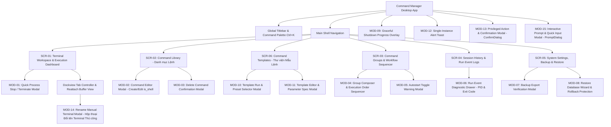
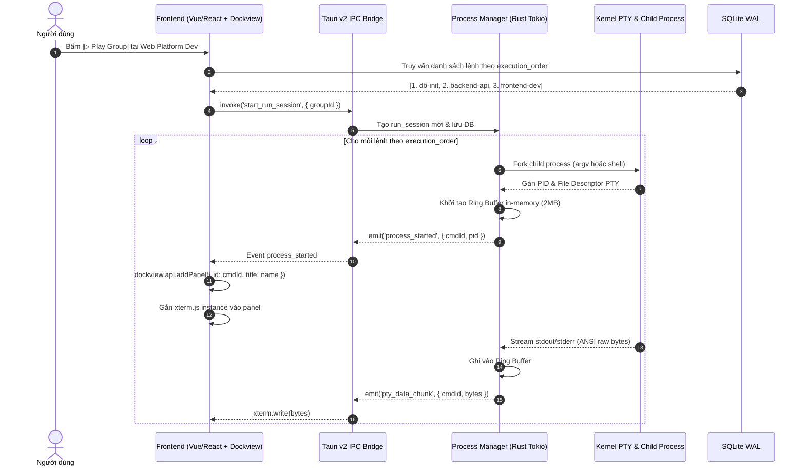
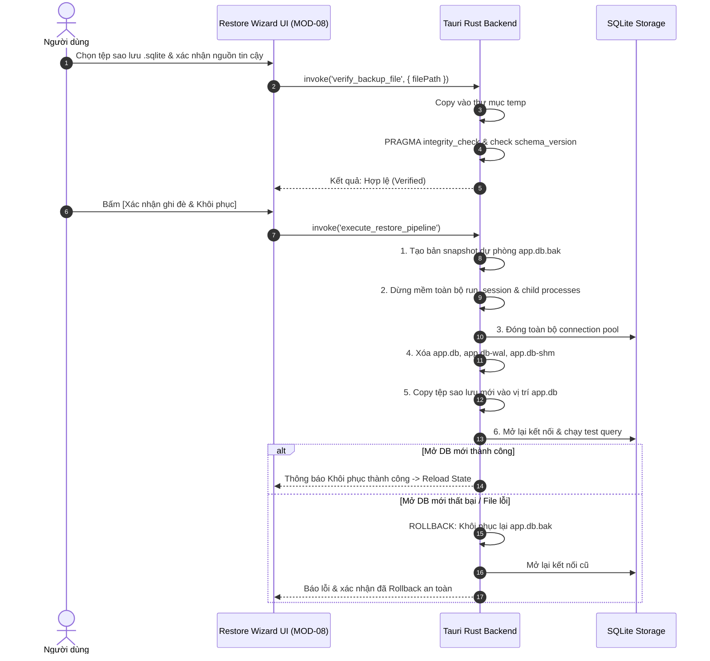

# Tài liệu Thiết kế Giao diện và Trải nghiệm Người dùng (UI/UX Screen Design Specification)

> **Dự án:** Ứng dụng Desktop Quản lý, Thực thi Lệnh và Terminal Đa nhiệm (Command Manager Desktop)  
> **Tài liệu tham chiếu:** [plan.md](./plan.md) | [checklist.md](./checklist.md)  
> **Nền tảng mục tiêu:** Tauri v2 (Rust Backend + Vite/TypeScript Frontend + SQLite WAL + PTY xterm.js + Dockview)

---

## 1. Nguyên tắc Thiết kế & Kiến trúc Giao diện Tổng thể

### 1.1. Triết lý Thiết kế (Design Principles)
1. **Developer-First & Information-Dense:** Giao diện tối ưu hóa cho lập trình viên, sysadmin và DevOps; mật độ thông tin cao nhưng gọn gàng, giảm thiểu các khoảng trống vô nghĩa, ưu tiên hiển thị trạng thái lệnh và luồng terminal.
2. **Trạng thái Trực quan Thời gian thực (Real-time Observability):** Mỗi lệnh và nhóm lệnh phải phản ánh tức thì trạng thái thực tế: *Idle / Ready*, *Running (kèm PID tạm & thời gian chạy)*, *Success (Exit code 0)*, *Failed (Exit code != 0)*, *Terminating*.
3. **Phân định Rõ ràng: Đóng Tab ≠ Hủy Tiến trình:** Thiết kế UI phải thể hiện rõ hợp đồng vòng đời: Đóng tab terminal chỉ ẩn giao diện hiển thị, tiến trình vẫn chạy ngầm trong backend. Nút "Stop" đỏ và hành động thoát ứng dụng mới kích hoạt quy trình Graceful Shutdown.
4. **Dark Mode Chủ đạo (Terminal Aesthetic):** Bảng màu tối chuẩn hiện đại (Slate/Zinc pha tím than), độ tương phản cao đạt chuẩn WCAG AA, phông chữ đơn cách (Monospace) chất lượng cao (JetBrains Mono / Fira Code) cho mọi chuỗi lệnh và màn hình terminal.
5. **Bảo vệ Vùng Tin cậy (Trusted Zone & Safe Fallback):** Các tác vụ đặc quyền (sửa chuỗi lệnh, nhập bản sao lưu đè DB, kích hoạt autostart) luôn có cờ cảnh báo rõ ràng và bước xác nhận an toàn.

---

### 1.2. Bố cục Khung Ứng dụng (App Shell Architecture)

Cấu trúc cửa sổ tuân thủ mô hình chuẩn của một Desktop IDE/Workstation hiện đại:

```
+-----------------------------------------------------------------------------------------------+
| [Icon] Command Manager v1.1.0        [Search Commands / Groups... Ctrl+K]      [_] [□] [X]    | <- Custom Titlebar
+-----------------------------------------------------------------------------------------------+
| NAV   | SUB-SIDEBAR       | MAIN WORKSPACE (Dockview Tabs & Content)                         |
| BAR   | (Groups / Tree)   |                                                                  |
| (64px)| (260px)           | +--------------------------------------------------------------+ |
|       |                   | | [Tab 1: API Server (PID: 1042)] [x] | [Tab 2: Web Dev] [x] | + | | <- Tab Bar
| [DSH] | > Active Sessions | +--------------------------------------------------------------+ |
| [CMD] |   ● Web Stack (2) | $ npm run dev -- --host                                        | |
| [GRP] |     ├─ vite (run) | VITE v5.4.2  ready in 280 ms                                   | |
| [LOG] |     └─ api  (run) | ➜  Local:   http://localhost:5173/                             | |
|       |                   | ➜  Network: http://192.168.1.15:5173/                          | |
|       | > Quick Launch    |                                                                | |
|       |   [▷ Run All]     |                                                                | |
|       |   [⏹ Stop All]    |                                                                | |
| ----- |                   |                                                                | |
| [SET] | [Autostart: ON]   |                                                                | |
+-----------------------------------------------------------------------------------------------+
| [STATUS BAR] ● 2 running | Ring Buffer: 420KB/2MB | SQLite: WAL | Single-Instance: Locked     |
+-----------------------------------------------------------------------------------------------+
```

* **Custom Titlebar (40px):** Tích hợp vùng kéo thả cửa sổ (`data-tauri-drag-region`), logo, thanh tìm kiếm nhanh toàn cục (Command Palette / Quick Jump `Ctrl+K`), nút thu nhỏ/phóng to/đóng với logic can thiệp sự kiện Close để thực hiện Graceful Shutdown.
* **Activity Bar / Nav Rail (60px):** Cố định bên trái với các biểu tượng điều hướng màn hình chính:
  * 🖥️ **Dashboard & Workspace (`/workspace`):** Không gian quản lý phiên chạy và Tabs Terminal.
  * ⚡ **Command Library (`/commands`):** Thư viện lệnh, cấu hình argv/shell.
  * 🧩 **Command Templates (`/templates`):** Thư viện mẫu lệnh có tham số (`{{param}}`), tạo preset và xem trước lệnh.
  * 📁 **Groups & Workflows (`/groups`):** Quản lý nhóm lệnh và thứ tự thực thi (`execution_order`).
  * 📜 **Session History & Logs (`/history`):** Lịch sử các `run_session` và sự kiện `run_event`.
  * ⚙️ **Settings & Backup (`/settings`):** Cấu hình Autostart, dung lượng Buffer, Sao lưu & Khôi phục SQLite.
* **Side Panel (Collapsible 260px):** Hiển thị danh sách ngữ cảnh tùy thuộc vào màn hình được chọn (ví dụ: Cây nhóm lệnh và trạng thái phiên chạy ở Workspace).
* **Main Content Area (Fluid):** Khu vực hiển thị linh hoạt với Dockview (hỗ trợ tab đa nhiệm và tương lai chia lưới Split View).
* **Global Status Bar (28px):** Thanh trạng thái kỹ thuật chân trang: số lượng tiến trình đang chạy, dung lượng ring buffer đang chiếm dụng, trạng thái kết nối SQLite WAL, cờ Autostart.

---

## 2. Bản đồ Màn hình & Cấu trúc Điều hướng (Screen Sitemap)



---

## 3. Thiết kế Chi tiết Từng Màn hình (Screen Specifications)

---

### Màn hình 1: SCR-01 — Terminal Workspace & Execution Dashboard (Tilix-Style Tiling Architecture)

> **Chi tiết thiết kế kiến trúc nâng cao:** Xem toàn bộ đặc tả giải thuật cây nhị phân, cấu trúc dữ liệu và ma trận phím tắt tại [docs/tilix-tiling-spec.md](./tilix-tiling-spec.md).

#### 1. Mục đích & Vai trò
Màn hình trung tâm điều hành hàng ngày của lập trình viên và kỹ sư hệ thống. Cho phép kích hoạt chạy theo nhóm hoặc từng lệnh riêng lẻ, giám sát trực quan các terminal PTY, xem log đầu ra gần đây từ ring buffer và kiểm soát vòng đời tiến trình. 

Đặc biệt, hệ thống kế thừa triết lý phân chia không gian tối ưu từ **Tilix Tiling Terminal Emulator**:
1. **Kiến trúc Chia Lát Gạch Tự Do (Recursive Binary Tree Tiling):** Vượt qua giới hạn chia 2 khung cứng nhắc (Dual-Pane A/B), cho phép chia đệ quy vô hạn cấp (Split Right `Ctrl+Alt+R`, Split Down `Ctrl+Alt+D`), dễ dàng tạo bố cục 3 panel (1 chính + 2 phụ), lưới 4 panel (2x2 Grid), hoặc 3 cột song song.
2. **Quản lý Đa Phiên Làm Việc (Multi-Workspace Sessions & Sessions Drawer):** Tổ chức các luồng công việc thành các Session độc lập (vd: Session "Web Dev", Session "Docker Cluster", Session "Monitoring").
3. **Mini-Headerbar Trên Từng Panel (Per-Pane Chrome - 28px):** Mỗi ô terminal sở hữu một header nhỏ tích hợp chỉ báo trạng thái tiến trình, tiêu đề động (OSC 0/2), huy hiệu PID, và các nút thao tác nhanh: Chia Phải, Chia Dưới, Phóng To (Zoom 100%), Đồng Bộ Phím (Sync), Dừng và Đóng.
4. **Thu Phóng Tức Thì (Pane Zoom / Maximize - Ctrl+Shift+Z):** Cho phép 1 panel mở rộng chiếm 100% diện tích workspace để soi log mà không làm hỏng cấu trúc cây tiling đã dựng.
5. **Đồng Bộ Bàn Phím Đa Nhiệm (Synchronized Keystroke Broadcasting):** Phát sóng cùng lúc nội dung gõ phím tới tất cả các terminal trong Session hoặc theo nhóm màu (Group), lý tưởng cho quản trị cụm máy chủ và container.
6. **Thư Viện Bố Cục Mẫu (Layout Presets):** 1-click kích hoạt ngay các layout quen thuộc: Single, 2 Cột, 2 Hàng, 2x2 Grid, 1 Lớn + 2 Nhỏ (1+2 Tiled), 3 Cột, hoặc lưu layout tùy biến.

#### 2. Wireframe Chi tiết

##### 2.1. Wireframe Chế độ Tilix Tiling N-Panes (Bố cục 1 Lớn + 2 Nhỏ & Thanh Sessions Drawer)

```
+-------------------------------------------------------------------------------------------------------------------------+
| [=] Workspace   | Phiên: Dev Stack (Started 14:20:05)   [⚡ 3 Ngầm] [Layout: ⊞ 1+2 ▾] [🔗 Sync: Session] [⏹ Stop All]   |
+-----------------+-------------------------------------------------------------------------------------------------------+
| SESSIONS DRAWER | KHUNG CHÍNH (PANE 1 - Active Focus)       | KHUNG PHỤ 1 (PANE 2 - Top Right)                          |
| ≡ SESSIONS  [+] | [●] api-server · PID 3102  ~/repo/api     | [●] vite-dev · PID 4091  [🔗 SYNC]  ~/repo/web            |
|-----------------| [◫ Chia Phải] [⬒ Chia Dưới] [🗖 Zoom] [✕] | [◫ Chia Phải] [⬒ Chia Dưới] [🗖 Zoom] [✕]                 |
| v Dev Stack (3) |-------------------------------------------+-----------------------------------------------------------|
|   [⊞ 1+2 Tiled] | [NestFactory] Starting Nest application.. | VITE v5.4.2 ready in 280 ms                               |
|   ● 3 running   | [RoutesResolver] AppController {/api}:    | ➜ Local:   http://localhost:5173/                         |
|                 |   Mapped {/api/v1/commands, GET} +2ms     | ➜ Network: http://192.168.1.15:5173/                      |
| > Docker Infra  | [HTTP] 10:14:08 GET /api/v1/health 200 OK |=================== SASH PHÂN CÁCH NGANG (ROW-RESIZE) =====|
|   [◫ 2 Cột Dọc] | ➜ cm-api git:(main) $                     | KHUNG PHỤ 2 (PANE 3 - Bottom Right)                       |
|   ● 1 running   |                                           | [●] worker-daemon · PID 4120  [🔗 SYNC]  ~/repo           |
|                 |                                           | [◫ Chia Phải] [⬒ Chia Dưới] [🗖 Zoom] [✕]                 |
| > Production    |                                           |-----------------------------------------------------------|
|   [⊞ 2x2 Grid]  |                                           | 1:M 28 Sep 10:15:01 * Ready to accept Redis connections   |
|   ○ Inactive    | <==== Viền Active Focus tím #744791 ====> | [WorkerEngine] Heartbeat acknowledged (queue: 0)          |
+-----------------+-------------------------------------------+-----------------------------------------------------------+
| Active: 3 panes | Ring Buffer: 680KB/2MB | Tiling: 1+2 Main/Sub | Sync: 2 Panes Linked | Shortcuts: Ctrl+Alt+R / D / S     |
+-------------------------------------------------------------------------------------------------------------------------+
```

##### 2.2. Wireframe Bố cục Lưới 4 Ô Cân Xứng (2x2 Grid Layout Mode)

```
+----------------------------------------------------------------------------------------------------+
| [=] Workspace   | Phiên: Microservices Cluster [Layout: ⊞ 2x2 Grid] [🔗 Sync: Off]   [⏹ Stop All]  |
+-----------------+-------------------------------------------------+--------------------------------+
| GROUPS / SESS   | PANEL 1: auth-service (PID: 3201)               | PANEL 2: billing-api (PID: 3205)|
| Search..        | [◫][⬒][🗖][✕] ~/repo/auth                        | [◫][⬒][🗖][✕] ~/repo/billing    |
| v Services (4)  |-------------------------------------------------+--------------------------------|
|   ● auth        | [AuthService] Initialized JWT public keys       | [Billing] Stripe webhook ready |
|   ● billing     | ➜ listening on :4001                            | ➜ listening on :4002           |
|   ● notifications========================= SASH NGANG (50%) =======================================|
|   ● analytics   | PANEL 3: notifications (PID: 3210)              | PANEL 4: analytics (PID: 3218) |
|                 | [◫][⬒][🗖][✕] ~/repo/notify                      | [◫][⬒][🗖][✕] ~/repo/analytics  |
|                 |-------------------------------------------------+--------------------------------|
|                 | [RabbitMQ] Channel connected: 'email_queue'     | [ClickHouse] Sink buffer 1024  |
|                 | ➜ listening on :4003                            | ➜ streaming telemetry to OLAP  |
+-----------------+-------------------------------------------------+--------------------------------+
```

##### 2.3. Wireframe Chế độ Thu Phóng Toàn Màn hình (Pane Zoom / Maximize State - Ctrl+Shift+Z)

```
+----------------------------------------------------------------------------------------------------+
| [=] Workspace   | Phiên: Dev Stack   [🗗 ĐANG ZOOM PANEL: api-server] [Ctrl+Shift+Z để khôi phục]  |
+-----------------+----------------------------------------------------------------------------------+
| SESSIONS DRAWER | PANEL 1: api-server (PID: 3102) - PHÓNG TO 100% DIỆN TÍCH      [🗗 Thu nhỏ] [⏹] [✕]|
| ≡ SESSIONS      | [● Running] · ttys004 · ~/repo/api · Kích thước viewport: 180x48                 |
|-----------------|----------------------------------------------------------------------------------+
| v Dev Stack (3) | [NestFactory] Starting Nest application...                                       |
|   [ZOOM ACTIVE] | [InstanceLoader] DatabaseModule dependencies initialized +36ms                   |
|   ● 3 running   | [DB] Connected to PostgreSQL pool (host: 127.0.0.1:5432, db: cm_dev, pool: 10)   |
|                 | [RoutesResolver] CommandController {/api/v1/commands}:                           |
|                 |   Mapped {/api/v1/commands, GET} route +2ms                                      |
|                 |   Mapped {/api/v1/commands/run, POST} route +1ms                                 |
|                 |   Mapped {/api/v1/health, GET} route +1ms                                        |
|                 | [Nest] application successfully started on port 3000                             |
|                 | [HTTP] 10:14:08.922 GET /api/v1/health 200 OK (2.1ms - 48 bytes)                 |
|                 | [HTTP] 10:14:12.304 POST /api/v1/commands/run 201 Created (14.2ms)              |
|                 | ➜ cm-api git:(main) $ _                                                          |
+-----------------+----------------------------------------------------------------------------------+
| Zoomed: 1 pane  | Bố cục gốc (1+2 Tiled) được bảo toàn trong bộ nhớ; bấm Ctrl+Shift+Z để trở lại    |
+----------------------------------------------------------------------------------------------------+
```

##### 2.4. Wireframe Bố Cục Thanh Bên Kèm Section Quick Access (Dual-Section Sidebar Wireframe)===== THANH PHÂN CÁCH SASH NGANG (KÉO CHUỘT / RESIZABLE) ========|
|                 | KHUNG DƯỚI (PANE B)                                                              |
|                 | [● bash-interactive-test] [x]  [+]                          [Actions: ⎚ | ⏹]     |
|                 |----------------------------------------------------------------------------------+
|                 | $ curl -X POST http://localhost:4000/api/v1/test-event                           |
|                 | {"success":true,"queued":1,"timestamp":"2026-09-28T10:15:05Z"}                   |
|                 | $ _                                                                              |
+-----------------+----------------------------------------------------------------------------------+
| Active: 2 panes | Pane A: 136x18 (Top)                          | Pane B: 136x14 (Bottom)          |
+----------------------------------------------------------------------------------------------------+
```

##### 2.4. Wireframe Bố Cục Thanh Bên Kèm Section Quick Access (Dual-Section Sidebar Wireframe)

```
+---------------------------+
| ≡ NHÓM LỆNH & PHIÊN   [⟳] |   <- header danh mục nhóm lệnh
|---------------------------|
| v Web Platform            |
|   [▷] [⏹] [Aut]           |
|   ● 01. db-init           |   Section 1: GroupTree (cuộn riêng)
|   ● 02. backend           |
| > Microservices           |
| > Standalone              |
|===========================|   <- sash kéo được (row-resize), nháy đúp = 50:50
| ⚡ QUICK ACCESS  (5)   [⌄] |   <- header section 2, [⌄] thu gọn / mở rộng
| → Terminal 2 · Khung A     |   <- chỉ báo terminal đích (§3.5)
| [🔍 Lọc...]               |   <- chỉ hiện khi có > 8 item
|---------------------------|
| Git Status        [▷][⎘]  |
|   git status -sb          |
| Docker PS         [▷][⎘]  |   Section 2: danh sách Quick Access (cuộn riêng)
|   docker ps --format ...  |
| Tail API log  ⚠   [▷][⎘]  |
|   tail -f logs/api.log    |
+---------------------------+
```

#### 3. Các Thành phần Giao diện & Data Binding
* **Left Sub-Sidebar: Execution Explorer (Tree View) & Quick Access Panel:**
  * **Cấu trúc 2 Section Dọc:** Thanh bên được chia dọc thành 2 section độc lập bằng thanh phân cách co giãn (Resizable Sash):
    * **Section 1 (Top - GroupTree):** Cây phân cấp nhóm lệnh (`command_group` -> `group_membership` -> `command_definition`), số thứ tự `execution_order` (`01.`, `02.`), trạng thái tiến trình (Idle, Starting, Running, Completed, Failed) và nút điều khiển nhanh nhóm (`[▷]` Play, `[⏹]` Stop).
    * **Thanh Phân Cách Sash Ngang (Row Splitter):** Cho phép kéo thả chuột để điều chỉnh tỉ lệ chiều cao giữa GroupTree và QuickAccessPanel (`cursor: row-resize`). Ràng buộc tối thiểu `min-height: 120px` cho mỗi section. Thao tác nháy đúp (`dblclick`) lập tức khôi phục tỉ lệ cân bằng chuẩn **50:50**. Trạng thái tỉ lệ và thu gọn được lưu vào `localStorage` (`cm_quick_access_ratio_v1`, `cm_quick_access_collapsed_v1`).
    * **Section 2 (Bottom - Quick Access Panel):** Danh sách các lệnh đã được bật cờ `quick_access`, hỗ trợ gửi chuỗi thực thi trực tiếp vào terminal đang focus mà không cần mở tab PTY riêng.
  * **Các Thành Phần Của Quick Access Panel:**
    * **Header Panel:** Tiêu đề `⚡ QUICK ACCESS`, huy hiệu đếm số lượng lệnh `(N)`, và nút toggle thu gọn/mở rộng `[⌄]`. Khi thu gọn, Section 2 co lại thành header thanh mảnh (28px), Section 1 chiếm trọn không gian còn lại.
    * **Chỉ Báo Terminal Đích (Target Terminal Indicator):** Hiển thị nhãn realtime `→ <tên tab> · Khung A/B` (sử dụng `tabLabel()`, phản ánh tiêu đề chương trình như `→ ✳ Claude Code · Khung A`). Khi tab đích đang bận chạy chương trình (`shellPhase = running`), hiển thị thêm `· đang bận`. Khi tab đích đã kết thúc tiến trình, hiển thị màu cảnh báo `(đã dừng)`.
    * **Thanh Lọc Nhanh (Filter Input):** Ô tìm kiếm `[🔍 Lọc...]` tự động kích hoạt hiển thị khi số lượng lệnh ghim Quick Access vượt quá 8 item.
    * **Quick Access Item Card:**
      * **Dòng 1:** Tên lệnh (`name`, chống tràn `text-overflow: ellipsis`), huy hiệu cảnh báo `⚠` nếu có độ lệch môi trường shell hoặc lệnh đa dòng trên shell thiếu bracketed paste, và 2 nút icon hành động:
        - `[▷]` **Run (`Play`):** Dán chuỗi lệnh vào terminal đích và gửi Enter thực thi ngay. Nếu dòng lệnh đang có chữ dở và con trỏ ở cuối dòng, hệ thống tự xóa dòng cũ bằng ký tự DEL rồi dán và chạy; nếu con trỏ ở giữa dòng, hệ thống chặn gửi và hiện toast nhắc nhở an toàn.
        - `[⎘]` **Paste (`ClipboardPaste`):** Chỉ dán chuỗi lệnh vào vị trí con trỏ của terminal đích mà không gửi Enter, cho phép người dùng kiểm tra và chỉnh sửa trước khi chạy.
      * **Dòng 2:** Chuỗi thực thi (`execution_string`) hiển thị dạng code monospace thu nhỏ 1 dòng; nếu lệnh có nhiều dòng, hiển thị dòng đầu kèm badge `↵ +N`.
      * **Tương tác Nháy Đúp (`dblclick`):** Nháy đúp vào item tương đương thao tác **Paste** an toàn.
      * **Tooltip & Khả Năng Tiếp Cận (`aria-label`):** Nêu rõ hành động và tên terminal đích, ví dụ: *"Run: Chạy 'Git Status' trong Terminal 1 · Khung A"*.
  * **Quy Tắc Hiển Thị Động Của Quick Access Panel:**
    * **Khi không có terminal đích:** (Workspace chưa mở tab nào, hoặc ở chế độ Split mà khung active đang trống): Section 2 và thanh phân cách sash **ẩn hoàn toàn**, GroupTree tự động giãn 100% chiều cao thanh bên.
    * **Empty State:** Khi chưa có lệnh nào được bật Quick Access, hiển thị giao diện rỗng gồm icon `Zap`, thông điệp *"Chưa có lệnh Quick Access. Bật switch ⚡ trong màn Lệnh"* và nút bấm `[Mở màn Lệnh]` điều hướng sang `/commands`.
    * **Trạng thái Tiến trình Đích Dừng:** Nếu tab đích đã dừng tiến trình, section vẫn hiển thị để theo dõi nhưng 2 nút Run và Paste chuyển sang trạng thái disabled kèm tooltip lý do.
* **Top Status Strip & Background Processes Button:**
  * Thẻ chỉ báo **`[⚡ 2 Ngầm]` / `[Active Daemons]`**: Cho biết số lượng tiến trình PTY đang chạy ngầm trong kernel backend Rust.
  * Click vào nút để bật/tắt **Menu Quản lý Tiến trình Chạy ngầm (Background Processes Manager Panel / Popover)**.
* **Menu Quản lý Tiến trình Chạy Ngầm (Background Processes Panel / Modal):**
  * **Header Panel:** Tiêu đề *"Tiến trình đang chạy ngầm (Active Daemons)"*, tổng số tiến trình active, nút **"Dừng Tất Cả Ngầm"** (Stop All Daemons) và nút đóng menu (Esc).
  * **Thanh Tiêu Đề Cột (List Column Headers):** Hiển thị 3 cột phân định thẳng hàng: `TIẾN TRÌNH / TÊN`, `TRẠNG THÁI TAB & BỘ NHỚ`, `THAO TÁC`.
  * **Danh sách tiến trình ngầm (Daemon List Items) - Bố cục 3 cột cố định, không rớt dòng:**
    * **Cột 1 - Định danh & Tên:** Dot trạng thái hoạt động (active running pulse); Huy hiệu phân loại (`[Terminal]` màu tím PTY vs `[Lệnh]` màu xanh command); Tên hiển thị đầy đủ (hiển thị tên tùy biến đã đổi, ví dụ `Dev Server`, hoặc `Terminal (POWERSHELL)` nếu là mặc định, với cơ chế chống rớt dòng `text-overflow: ellipsis`); Dòng meta hiển thị `#commandId`, `PID` và loại shell.
    * **Cột 2 - Trạng thái Tab & Bộ nhớ Ring Buffer:** Căn lề thẳng hàng tuyệt đối trên toàn bộ danh sách; Huy hiệu trạng thái UI Tab (**`[👁️ Tab đang hiển thị]`** màu xanh blue Attached hoặc **`[👁️‍🗨️ Tab đang ẩn (Detached)]`** màu vàng cam khi đóng ẩn tab); Dòng telemetry hiển thị dung lượng bộ đệm Ring Buffer (ví dụ `Buffer: 118 B · Running`).
    * **Cột 3 - Thao tác Hành động trực tiếp:** Nút **`[👁️ Mở lại Tab / Focus Tab]`** (khôi phục tab trên Dockview kèm tên tùy biến; khi ở chế độ Split Mode có tùy chọn mở vào Pane A hoặc Pane B); nút **`[📜 Xem Log]`** (mở drawer Ring Buffer); nút **`[⏹ Dừng]`** (SIGTERM); nút **`[💀 Force Kill]`** (SIGKILL).
* **Main Area: Chế độ Tilix Tiling Terminal Workspace (Recursive Binary Tree & Multi-Session PTY):**
  * **Kiến trúc Cây Nhị phân Đệ quy (Recursive Binary Tree Tiling Engine):**
    - Thay thế mô hình 2 pane tĩnh bằng cấu trúc cây đệ quy `TilingNode` (chi tiết tại [docs/tilix-tiling-spec.md](./tilix-tiling-spec.md)).
    - Mỗi Session quản lý một cây layout độc lập, hỗ trợ chia đôi N lần theo chiều ngang hoặc dọc.
    - Hỗ trợ thêm/bớt panel linh hoạt: khi chia đôi (Split Right `Ctrl+Alt+R` hoặc Split Down `Ctrl+Alt+D`), panel mới được chèn làm nhánh con kề cạnh; khi đóng panel (`[✕]` hoặc `Ctrl+Shift+W`), không gian được tự động hoàn lại cho sibling node kề cạnh.
  * **Thanh Công Cụ Workspace & Layout Presets Toolbar:**
    - **Menu Layout Presets (Bố cục Mẫu):**
      - `[◻] Single Pane` (100% diện tích).
      - `[◫] 2 Columns` (50:50 trái - phải).
      - `[⬒] 2 Rows` (50:50 trên - dưới).
      - `[⊞] 2x2 Grid` (4 ô vuông đối xứng).
      - `[◨] 1+2 Tiled` (1 panel chính 60% bên trái + 2 panel phụ xếp tầng bên phải).
      - `[⬓] 1 Top Main + 2 Bottom` (1 panel chính nằm trên, 2 panel phụ nằm dưới).
      - `[⚏] 3 Columns` (3 cột song song 33:33:33).
      - `[💾] Lưu Layout Thành Mẫu Mới...`: Lưu cấu trúc phân nhánh hiện tại vào danh sách preset.
    - **Bộ Điều Khiển Phát Sóng Gõ Phím Đồng Bộ (Synchronized Input Broadcast):**
      - Toggle switch: `Off` | `Session` | `Group`.
      - Khi bật `Session` hoặc `Group`, bất kỳ ký tự nào gõ vào panel đang active sẽ được phát sóng đồng thời qua IPC stdin tới tất cả các terminal liên kết.
      - Panel đang được liên kết hiển thị viền phát xung và huy hiệu `[🔗 SYNC]` màu tím/xanh nổi bật.
    - **Nút Batch Action:** `[▷ Chạy lại cả Session]`, `[⏹ Dừng cả Session]`.
  * **Mini-Headerbar Trên Từng Terminal Panel (28px Per-Pane Chrome):**
    - Nằm ngay trên đỉnh mỗi terminal viewport, trang bị đầy đủ controls cục bộ:
      - Dot trạng thái hoạt động: 🟢 Running, 🟡 Starting, ⚪ Exited, 🔴 Failed.
      - Tên terminal tùy biến (hỗ trợ nháy đúp đổi tên MOD-14) và tiêu đề chương trình (OSC 0/2).
      - Huy hiệu PID và thư mục CWD hiện tại.
      - Huy hiệu `[🔗 SYNC]` khi đang ở chế độ gõ phím đồng bộ.
      - Cụm nút thao tác nhanh:
        - `[◫]` Split Right (Chia sang phải).
        - `[⬒]` Split Down (Chia xuống dưới).
        - `[🗖]` Zoom / Maximize (Phóng to 100% / Khôi phục layout cũ bằng `Ctrl+Shift+Z`).
        - `[🔄]` Reattach Buffer (Xả lại 1MB/2MB log từ ring buffer).
        - `[⎚]` Clear (Xóa màn hình xterm cục bộ).
        - `[⏹]` Stop Process (Gửi SIGTERM).
        - `[✕]` Close Pane (Thu hồi panel khỏi cây nhị phân, tiến trình vẫn chạy ngầm nếu là daemon).
  * **Thanh Phân Cách Điều Chỉnh Kích Thước Đa Trục (Interactive Multi-Axis Resizable Sashes):**
    - Phân bố dọc và ngang giữa các panel kề nhau.
    - Độ dày 5px, hover/drag chuyển sang màu chủ đạo `--primary: #744791` kèm hiệu ứng glow.
    - Con trỏ tự động chuyển `col-resize` hoặc `row-resize`.
    - Ràng buộc an toàn: Tối thiểu `min-width: 200px` và `min-height: 120px` mỗi ô terminal để tránh co rút xterm.js.
    - Nháy đúp (`dblclick`) vào thanh sash bất kỳ lập tức cân bằng lại 2 panel con về tỉ lệ chuẩn **50:50**.
  * **Cơ Chế Thu Phóng Tức Thì (Pane Zoom / Maximize):**
    - Cho phép lập trình viên tập trung quan sát log của 1 panel duy nhất trong chốc lát mà không cần đóng các panel khác.
    - Khi Zoom được kích hoạt, layout cây nhị phân được "đóng băng" (freeze) trong bộ nhớ, viewport được mở rộng 100% diện tích workspace.
    - Nhấn `Ctrl+Shift+Z` lần nữa sẽ "giải đông" (unfreeze) và trả lại chính xác vị trí, kích thước dòng cột ban đầu.
  * **Thanh Quản Lý Phiên Làm Việc (Sessions Drawer / Sidebar):**
    - Cho phép tạo nhiều Phiên làm việc (Sessions), mỗi phiên có 1 cây tiling layout riêng.
    - Hiển thị danh sách card kèm sơ đồ thu nhỏ (mini layout thumbnail), số lượng terminal đang chạy.
    - Chuyển đổi qua lại giữa các Session mượt mà bằng phím tắt `Ctrl+PageUp` / `Ctrl+PageDown`.
  * **Cơ Chế Đồng Bộ Kernel PTY & FitAddon Độc Lập:**
    - Mỗi `XtermPane` trong từng ô panel sở hữu một instance `ResizeObserver` độc lập.
    - Khi kéo bất kỳ thanh sash nào hoặc đổi kích thước cửa sổ app:
      - Từng instance xterm gọi `fitAddon.fit()` theo kích thước pixel thực tế của ô panel đó.
      - Backend Rust nhận sự kiện `pty_resize({ commandId, cols, rows })` và cập nhật kích thước terminal kernel.
      - Đảm bảo các giao diện tương tác CLI (như `htop`, `vim`, `nano`, các bảng log kẻ khung) tự động vẽ lại vừa khít với kích thước của từng Pane mà không bị vỡ chữ hay lệch hàng.

#### 4. Các Trạng thái Giao diện (UI States)
* **Single View State:** Chế độ 1 khung mặc định. Toàn bộ các tab nằm chung trên một Tab Strip duy nhất chiếm 100% chiều rộng.
* **Split Horizontal State (Left | Right):** Chia đôi theo chiều dọc. Hai khung Pane A và Pane B hiển thị song song trái-phải, ngăn cách bởi thanh Sash dọc.
* **Split Vertical State (Top / Bottom):** Chia đôi theo chiều ngang. Hai khung hiển thị trên-dưới, ngăn cách bởi thanh Sash ngang.
* **Sash Dragging State:** Trạng thái người dùng đang nhấn giữ chuột kéo thanh phân cách. Cả 2 viewport terminal hiển thị lớp phủ trong suốt (transparent pointer-events guard) để việc kéo chuột không bị chặn bởi iframe hoặc canvas xterm, con trỏ giữ nguyên dạng `col-resize` hoặc `row-resize`.
* **Cross-Pane Dragging State:** Trạng thái đang kéo một tab bay qua ranh giới giữa 2 khung. Tab Strip của khung đích hiển thị vạch placeholder đánh dấu vị trí sẽ chèn vào.
* **Empty State:** Chưa có nhóm hoặc lệnh nào chạy: Hiển thị minh họa đồ họa, thông điệp *"Không có phiên chạy nào đang mở. Chọn một nhóm lệnh từ danh sách bên trái hoặc nhấn Play để bắt đầu"*.
* **Reattaching State:** Khi người dùng mở lại một tab đã bị đóng trước đó: Hiển thị spinner nhẹ *"Đang kết nối lại PTY & xả dữ liệu từ bộ nhớ đệm..."* trước khi xterm render lại nội dung.
* **Process Exit State:** Khi tiến trình kết thúc (dù thành công hay thất bại), xterm vẫn giữ nguyên nội dung kèm một thông báo thanh mảnh ở góc trên terminal: `[Process exited with code 0 - Press Enter or Click Restart to rerun]`.

---

### Màn hình 2: SCR-02 — Quản lý Thư viện Lệnh (Command Library)

#### 1. Mục đích & Vai trò
Nơi định nghĩa, cấu hình và quản trị toàn bộ các câu lệnh độc lập (`command_definition`). Quản lý cách thức thực thi rõ ràng: Chạy trực tiếp qua mảng đối số (argv) hay qua vỏ lệnh (shell), bảo vệ tính toàn vẹn của chuỗi thực thi.

#### 2. Wireframe Chi tiết

```
+----------------------------------------------------------------------------------------------------------+
| [=] Command Library   [🔍 Search...]   [Filter: All / Shell / Argv / ⚡ Quick Access]   [+ Tạo Lệnh Mới]   |
+----------------------------------------------------------------------------------------------------------+
| TÊN LỆNH           | KIỂU THỰC THI | CHUỖI LỆNH                        | NHÓM         | ⚡ QUICK | HÀNH ĐỘNG     |
|--------------------+---------------+-----------------------------------+--------------+----------+---------------|
| Git Status         | [Shell: zsh]  | git status -sb                    | (Chưa gán)   |  [●━]    | [▷] [✎] [⧉] [🗑] |
| Vite Frontend Dev  | [Shell: bash] | pnpm --filter web dev --port 3000 | Web Platform |  [━○]    | [▷] [✎] [⧉] [🗑] |
| Docker PS          | [Direct Argv] | docker ps --format "{{.Names}}"   | Infra        |  [●━]    | [▷] [✎] [⧉] [🗑] |
+----------------------------------------------------------------------------------------------------------+
| Tổng cộng: 14 lệnh | 8 Shell | 6 Argv | ⚡ 5 Quick Access                                                   |
+----------------------------------------------------------------------------------------------------------+
```

#### 3. Bảng Dữ liệu & Quy cách Thao tác
* **Các cột hiển thị:**
  1. **Tên Lệnh (`name`):** Nhãn gợi nhớ thân thiện (ví dụ: `Vite Frontend Dev`).
  2. **Kiểu Thực thi (`is_shell`):** Badge trực quan:
     * 🟩 `Direct Argv`: Phân tách argv tường minh, an toàn, không chạy qua trung gian shell.
     * 🟨 `Shell (bash/sh)`: Chạy qua shell hệ thống để hỗ trợ piping (`|`), redirect (`>`), biến môi trường (`$VAR`).
  3. **Chuỗi Lệnh (`execution_string`):** Hiển thị dạng code mono block có truncate kèm nút "Copy".
  4. **Nhóm thuộc về:** Liệt kê các nhóm lệnh đang chứa command này (từ bảng `group_membership`).
  5. **Quick Access (`quick_access`):**
     * Switch toggle bật/tắt trực tiếp trên từng dòng table row, có hiệu lực ngay lập tức qua IPC `commands_set_quick_access(id, enabled, confirmed: true)`.
     * Switch hiển thị trạng thái loading spinner / disabled trong lúc chờ backend xác nhận; nếu gặp sự cố sẽ tự động hoàn nguyên (rollback) về trạng thái cũ và kích hoạt Toast cảnh báo lỗi.
     * Tooltip switch: *"Hiện lệnh này trong mục Quick Access ở màn Terminal"*.
  6. **Hành động (Action Buttons):**
     * `[▷]` Chạy ngay lập tức (mở sang Workspace).
     * `[✎]` Chỉnh sửa (mở Modal MOD-02).
     * `[⧉]` Nhân bản lệnh (Duplicate).
     * `[🗑]` Xóa lệnh (Yêu cầu xác nhận an toàn MOD-03).
* **Bộ Lọc Nhanh & Thống Kê Thanh Điều Hướng:**
  * **Bộ lọc `⚡ Quick Access`:** Bổ sung tab filter nhanh `⚡ Quick Access` vào cụm tab `All` / `Shell` / `Argv`, cho phép lọc ngay lập tức các lệnh đang được gắn cờ.
  * **Chỉ số Telemetry Footer:** Hiển thị số lượng lệnh Quick Access (ví dụ `⚡ 5 Quick Access`) bên cạnh tổng số lệnh và phân loại thực thi.

---

### Màn hình 3: SCR-03 — Quản lý Nhóm Lệnh & Điều phối Thứ tự Chạy (Command Groups & Sequencer)

#### 1. Mục đích & Vai trò
Thiết lập danh mục các nhóm lệnh (`command_group`), gắn cờ tự khởi động cùng app (`autostart`), và sắp xếp thứ tự thực thi tuần tự (`execution_order`) giữa các lệnh trong nhóm.

#### 2. Wireframe Chi tiết

```
+----------------------------------------------------------------------------------------------------+
| [=] Command Groups       [🔍 Search groups...]                             [+ Tạo Nhóm Mới]        |
+----------------------------------------------------------------------------------------------------+
| [CARD 1: Web Platform Development]                                             [Autostart: [ON ] ] |
| Mô tả: Khởi động toàn bộ stack phát triển cục bộ cho web app                   Trạng thái: 2/3 run |
| Lệnh thực thi tuần tự theo execution_order:                                                        |
|   1. ⠿ [Argv] docker-postgres-start    (Timeout: 10s)                          [Active: Code 0]    |
|   2. ⠿ [Shell] nestjs-backend-api      (Wait: until ready)                     [Running: PID 2845] |
|   3. ⠿ [Shell] vite-frontend-dev       (Wait: parallel)                        [Running: PID 2841] |
| Hành động: [▷ Chạy toàn nhóm]  [⏹ Dừng toàn nhóm]  [✎ Sắp xếp & Chỉnh sửa]  [🗑 Xóa nhóm]          |
|----------------------------------------------------------------------------------------------------|
| [CARD 2: Cloudflare Remote Tunnel]                                             [Autostart: [OFF] ] |
| Mô tả: Mở đường hầm bảo mật cho staging preview                                Trạng thái: Idle    |
| Lệnh thực thi:                                                                                     |
|   1. ⠿ [Argv] cloudflared tunnel run dev-tunnel                                [Idle]              |
| Hành động: [▷ Chạy toàn nhóm]  [⏹ Dừng toàn nhóm]  [✎ Sắp xếp & Chỉnh sửa]  [🗑 Xóa nhóm]          |
|----------------------------------------------------------------------------------------------------|
| [CARD 3: Database Migration & Seed]                                            [Autostart: [OFF] ] |
| Mô tả: Chạy migrate DB rồi tự thoát                                            Trạng thái: Idle    |
| Lệnh thực thi:                                                                                     |
|   1. ⠿ [Shell] pnpm prisma migrate dev                                         [Idle]              |
|   2. ⠿ [Shell] pnpm prisma db seed                                             [Idle]              |
| Hành động: [▷ Chạy toàn nhóm]  [⏹ Dừng toàn nhóm]  [✎ Sắp xếp & Chỉnh sửa]  [🗑 Xóa nhóm]          |
+----------------------------------------------------------------------------------------------------+
```

#### 3. Các Tính năng Đặc thù
* **Autostart Switch:** Toggle trực tiếp cờ `autostart` trên card. Khi bật ON, hệ thống kích hoạt nhóm này tự động ngay khi ứng dụng khởi chạy và đã nắm giữ Single-Instance Lock.
* **Kéo thả Sắp xếp Thứ tự (`execution_order`):** Icon tay cầm kéo thả `⠿` cho phép hoán đổi vị trí nhanh các lệnh, tự động cập nhật lại trường `execution_order` (1, 2, 3...) trong SQLite `group_membership`.
* **Play All Sequence:** Khi nhấn "Chạy toàn nhóm", Process Manager Rust sẽ duyệt theo thứ tự `execution_order`.

---

### Màn hình 4: SCR-04 — Lịch sử Phiên Chạy & Nhật ký Sự kiện (Session History & Logs)

#### 1. Mục đích & Vai trò
Theo dõi các phiên chạy trong quá khứ được lưu tĩnh trong SQLite (`run_session` và `run_event`). Cung cấp thông tin chẩn đoán lỗi (exit code, thời lượng chạy, PID lúc chạy) mà không làm phình cơ sở dữ liệu do không ghi stream log PTY vào đĩa.

#### 2. Wireframe Chi tiết

```
+----------------------------------------------------------------------------------------------------+
| [=] Session History & Event Logs     [Filter: All Groups / Web Platform]  [Date: Today / Last 7d]  |
+----------------------------------------------------------------------------------------------------+
| DANH SÁCH PHIÊN (run_session)       | CHI TIẾT SỰ KIỆN THỰC THI (run_event của session #108)        |
|-------------------------------------+--------------------------------------------------------------|
| [SESSION #108] Web Platform Dev     | Nhóm: Web Platform Dev | Bắt đầu: 2026-09-25 14:20:05        |
| Started: 14:20:05 | Status: RUNNING | Trạng thái tổng: Đang chạy (Active)                          |
| 3 commands | 2 active, 1 ended      |--------------------------------------------------------------|
|                                     | COMMAND          | STARTED  | ENDED    | EXIT | PID  | LOG MEMORY|
| [SESSION #107] DB Migration & Seed  |------------------+----------+----------+------+------+-----------|
| Started: 11:05:12 | Status: SUCCESS | docker-postgres  | 14:20:05 | 14:20:10 | 0    | 2830 | [Xem Log] |
| Duration: 45s | Exit Code: 0        | nestjs-backend   | 14:20:10 | -        | -    | 2845 | [Xem PTY] |
|                                     | vite-frontend    | 14:20:12 | -        | -    | 2841 | [Xem PTY] |
| [SESSION #106] Cloudflare Tunnel    |--------------------------------------------------------------|
| Started: 09:15:00 | Status: FAILED  | Chẩn đoán nhanh:                                             |
| Exit code 1 (Tunnel credentials err)| Lệnh 'docker-postgres' kết thúc thành công (exit 0) sau 5s.  |
|                                     | Tiến trình backend & frontend đang stream PTY in-memory.     |
+-------------------------------------+--------------------------------------------------------------+
```

#### 3. Quy định Hiển thị & Lưu trữ Dữ liệu
* **Tách biệt Triệt để DB vs In-Memory:**
  * DB SQLite chỉ lưu: Thời gian bắt đầu (`started_at`), Thời gian kết thúc (`ended_at`), Trạng thái (`status`), Mã thoát (`exit_code`), và Mã tiến trình (`pid` phục vụ chẩn đoán tạm thời).
  * Cột **LOG MEMORY:**
    * Nếu phiên đang chạy hoặc vừa chạy trong phiên app hiện tại: Cho phép nhấn `[Xem PTY]` để xem nội dung từ Ring Buffer in-memory.
    * Nếu app đã từng khởi động lại hoặc session cũ: Nút chuyển sang trạng thái xám `[Đã giải phóng]` kèm tooltip: *"Tuân thủ kiến trúc bảo mật & hiệu năng: Log luồng PTY không lưu trữ ra đĩa cứng"*.

---

### Màn hình 5: SCR-05 — Cài đặt Hệ thống, Sao lưu & Khôi phục (Settings, Backup & Restore)

#### 1. Mục đích & Vai trò
Quản lý cấu hình cấp ứng dụng, cơ chế tự khởi động cùng OS, quản lý bộ nhớ đệm PTY, và thực hiện quy trình sao lưu / phục hồi SQLite an toàn với cơ chế kiểm tra tính toàn vẹn (Integrity Check) và Rollback tự động.

#### 2. Wireframe Chi tiết

```
+----------------------------------------------------------------------------------------------------+
| [=] Settings & Data Management                                                                     |
+----------------------------------------------------------------------------------------------------+
| [TAB 1: Tự Khởi Động & Hệ Thống]  [TAB 2: Terminal & Buffer]  [TAB 3: Sao Lưu & Khôi Phục Dữ Liệu] |
+----------------------------------------------------------------------------------------------------+
| 📦 SAO LƯU DỮ LIỆU CỤC BỘ (BACKUP / EXPORT)                                                        |
| Tạo bản sao snapshot toàn vẹn của cơ sở dữ liệu SQLite (WAL mode) bằng lệnh VACUUM INTO an toàn.    |
| Bản sao lưu bao gồm: Danh mục lệnh, Nhóm lệnh, Cấu hình thứ tự và Lịch sử phiên chạy.               |
|                                                                                                    |
| Vị trí lưu mặc định: ~/backups/command-manager/                                                    |
| Tên file tự sinh:    cm_backup_2026-09-25_160821.sqlite                                            |
|                                                                                                    |
| [ 📥 Xuất Bản Sao Lưu Ngay (Export Backup) ]  -- Kiểm tra PRAGMA integrity_check trước khi báo OK  |
|----------------------------------------------------------------------------------------------------|
| ⚠️ KHÔI PHỤC DỮ LIỆU (RESTORE / IMPORT)                                                             |
| Nạp dữ liệu từ file backup .sqlite bên ngoài vào ứng dụng.                                         |
| Quy trình an toàn 7 bước:                                                                          |
|   1. Kiểm tra tính toàn vẹn (integrity_check) & Schema version                                     |
|   2. Tự động sao lưu dự phòng file app.db hiện tại                                                 |
|   3. Dừng an toàn mọi tiến trình & phiên chạy đang active                                          |
|   4. Đóng toàn bộ connection SQLite, xóa sạch app.db-wal & app.db-shm                             |
|   5. Ghi đè file mới & Khởi tạo lại kết nối                                                        |
|   6. Tự động Rollback hoàn trả nếu việc mở DB mới gặp lỗi                                          |
|                                                                                                    |
| [ 📤 Chọn Tệp Sao Lưu Để Khôi Phục... ]                                                            |
|----------------------------------------------------------------------------------------------------|
| ⚙️ THIẾT LẬP VÒNG ĐỜI TIẾN TRÌNH & BỘ NHỚ                                                          |
| Kích thước Ring Buffer in-memory mỗi PTY:  [ 2 MB       ▼ ] (Giới hạn byte để chống tràn RAM)      |
| Thời gian chờ dừng tiến trình (Graceful):  [ 8 giây     ▼ ] (SIGTERM -> chờ timeout -> SIGKILL)    |
| Tự khởi động cùng Hệ điều hành (OS Boot):  [ BẬT (ON)   ▼ ] (tauri-plugin-autostart)               |
+----------------------------------------------------------------------------------------------------+
```

---

### Màn hình 6: SCR-06 — Quản lý Thư viện Mẫu Lệnh (Command Templates)

#### 1. Mục đích & Vai trò
Quản lý các mẫu lệnh tái sử dụng chứa các tham số linh hoạt theo dạng placeholder (ví dụ: `ffmpeg -i {{input}} -crf {{crf}} {{output}}`). Cho phép xem danh sách template, quản lý các định nghĩa tham số, lưu lại các bộ giá trị thường dùng (Presets), xem trước câu lệnh đã render và kích hoạt thực thi nhanh trong tab PTY Terminal mà không cần nhập lại lệnh thủ công hay tiếp xúc trực tiếp với chuỗi dòng lệnh phức tạp.

#### 2. Wireframe Chi tiết

```
+----------------------------------------------------------------------------------------------------+
| [=] Command Templates    [🔍 Tìm kiếm template theo tên, placeholder...]  [Filter: All / Shell / Argv]|
|                          [+ Tạo Template Mới]                                                      |
+----------------------------------------------------------------------------------------------------+
| TÊN TEMPLATE      | KIỂU | CẤU TRÚC MẪU (TEMPLATE STRING)          | THAM SỐ (PARAMS)| LẦN CHẠY CUỐI | HÀNH ĐỘNG   |
|-------------------+------+-----------------------------------------+-----------------+---------------+-------------|
| FFmpeg Video Conv | Shell| ffmpeg -i {{input}} -crf {{crf}} {{out}} | 3 (1 secret)    | 10 phút trước | [▷] [✎] [⧉] [🗑] |
| Curl API Request  | Argv | curl -X {{method}} {{url}} -H {{auth}}  | 3 (1 secret)    | Hôm qua       | [▷] [✎] [⧉] [🗑] |
| Docker Run        | Shell| docker run -d -p {{host_port}}:{{port}} | 3 params        | 3 ngày trước  | [▷] [✎] [⧉] [🗑] |
| Postgres DB Dump  | Argv | pg_dump -h {{host}} -U {{user}} {{db}}  | 3 (1 secret)    | Chưa chạy     | [▷] [✎] [⧉] [🗑] |
+----------------------------------------------------------------------------------------------------+
| Tổng cộng: 4 templates | 2 Shell templates | 2 Direct Argv templates            | Trang: [<] 1 [>]    |
+----------------------------------------------------------------------------------------------------+
```

#### 3. Các Thành phần Giao diện & Data Binding
* **Header & Telemetry Ribbon:**
  * Huy hiệu `v2.2 Templates Engine`.
  * Nút `+ Tạo Template Mới`: Mở modal `TemplateEditorModal` (MOD-11) với mẫu trống.
  * 4 Thẻ Quick Stats Telemetry Ribbon:
    * `TỔNG TEMPLATE`: Đếm tổng số bản ghi trong `command_template`.
    * `SHELL TEMPLATES`: Số lượng template dùng môi trường Shell wrapper.
    * `DIRECT ARGV TEMPLATES`: Số lượng template dùng phân tách mảng `argv` trực tiếp.
    * `ĐÃ LƯU PRESETS`: Tổng số bộ tham số preset sẵn có từ `template_preset`.
* **Thanh Tìm Kiếm & Lọc:**
  * Khung nhập từ khóa tìm kiếm theo tên template hoặc cú pháp placeholder.
  * Filter Dropdown: `Tất cả` / `Direct Argv` / `Shell Execution`.
* **Bảng Danh Mục Mẫu Lệnh (Templates Table):**
  * **Tên Template (`name`):** Tên gợi nhớ và mô tả vắn tắt.
  * **Kiểu thực thi (`is_shell`):** Badge `Direct Argv` (Xanh lá) hoặc `Shell` (Vàng).
  * **Cấu trúc Mẫu (`template_string`):** Chuỗi mẫu monospaced highlight các biến dạng `{{param_name}}`.
  * **Danh sách Tham số (`params`):** Badge hiển thị số lượng tham số khai báo kèm số lượng secret (ví dụ: `3 params (1 secret)`).
  * **Lần chạy gần nhất:** Thời gian tương đối tính từ `run_session` có `template_id` tương ứng.
  * **Hành động (Action Buttons):**
    * `[▷]` **Chạy Template:** Mở modal `TemplateRunModal` (MOD-10) để điền params, chọn preset và thực thi.
    * `[✎]` **Chỉnh sửa Template:** Mở modal `TemplateEditorModal` (MOD-11) để sửa mẫu lệnh và danh sách `template_param`.
    * `[⧉]` **Nhân bản (Duplicate):** Tạo bản sao template kèm toàn bộ khai báo tham số.
    * `[🗑]` **Xóa:** Xóa template (CASCADE xóa các param và preset liên quan sau khi người dùng xác nhận).

#### 4. Các Trạng thái Giao diện (UI States)
* **Empty State:** Chưa tạo template nào: Hiển thị hình minh họa mẫu lệnh, thông điệp *"Chưa có Template nào. Tạo mẫu lệnh đầu tiên để tự động hóa công việc lặp đi lặp lại với tham số động"*.
* **Validation Warning State:** Khi template string chứa placeholder chưa được khai báo loại param trong bảng: Hiển thị badge cảnh báo màu vàng `⚠️ 1 placeholder chưa khai báo` cạnh tên template.


---

## 4. Thiết kế Chi tiết Các Hộp Thoại & Hộp Cảnh Báo (Modals & Dialogs)

---

### MOD-02: Modal Thêm / Chỉnh Sửa Lệnh (Command Definition Editor)

* **Tiêu đề:** *"Tạo Câu Lệnh Mới"* hoặc *"Chỉnh Sửa Câu Lệnh: [Tên]"*
* **Kích thước:** 640px x 580px (Modal trung tâm có backdrop làm mờ).
* **Wireframe:**

```
+-----------------------------------------------------------------------------+
|  ⚡ Chỉnh Sửa Câu Lệnh                                                 [X]  |
+-----------------------------------------------------------------------------+
|  Tên gợi nhớ của lệnh (*)                                                   |
|  [ Vite Frontend Dev Server                                            ]    |
|                                                                             |
|  Phương thức thực thi (*)                                                   |
|  ( ) Chạy trực tiếp qua mảng đối số (Direct Argv) - Khuyến nghị an toàn     |
|      Chạy thẳng binary, không qua shell trung gian, tránh escape lỗi ký tự. |
|  (o) Chạy qua vỏ lệnh (Shell Execution: bash / sh / zsh / cmd)              |
|      Dùng khi lệnh cần nối ống (pipe |), xuất file (>), hoặc biến môi trường|
|                                                                             |
|  Chuỗi dòng lệnh (Execution String) (*)                                     |
|  +-----------------------------------------------------------------------+  |
|  | pnpm --filter web run dev --host 0.0.0.0 --port 3000                  |  |
|  |                                                                       |  |
|  +-----------------------------------------------------------------------+  |
|  [⚡ Kiểm tra cú pháp nhanh]               Môi trường giả lập: Shell Default |
|                                                                             |
|  Thư mục làm việc (Working Directory - Tùy chọn)                            |
|  [ /data/Second/htdocs/projects/command-manager                      ] [Duyệt]|
|                                                                             |
|  Gán vào Nhóm lệnh                                                          |
|  [x] Web Platform Development    [ ] Infrastructure    [ ] Microservices     |
|                                                                             |
|  ⚡ Quick Access                                                   [●━]      |
|  Hiện trong mục Quick Access ở màn Terminal để dán hoặc chạy nhanh           |
|  vào terminal đang focus.                                                   |
+-----------------------------------------------------------------------------+
|  [Hủy Bỏ]                                          [💾 Lưu Định Nghĩa Lệnh]  |
+-----------------------------------------------------------------------------+
```

* **Ràng buộc & Validate:**
  * `name`: Bắt buộc, độ dài từ 2 đến 100 ký tự, không chứa ký tự điều khiển.
  * `execution_string`: Bắt buộc, không được để trống.
  * `is_shell`: Radio button rõ ràng. Nếu người dùng chọn Shell, hiển thị cảnh báo nhỏ: *"Lưu ý: Lệnh chạy trong Shell có thể chịu ảnh hưởng bởi biến môi trường của hệ thống host"*.
  * `quick_access`: Switch toggle "⚡ Quick Access". Mặc định tắt (`false`) khi tạo mới lệnh. Khi nhân bản lệnh (Duplicate `[⧉]`), giữ nguyên giá trị của lệnh gốc. Giá trị được lưu đồng bộ cùng form qua IPC `commands_create` / `commands_update`.

---

### MOD-04: Modal Soạn Nhóm Lệnh & Thứ Tự Thực Thi (Group Composer)

* **Tiêu đề:** *"Cấu Hình Nhóm Lệnh & Trình Tự Thực Thi (Workflow Sequencer)"*
* **Wireframe:**

```
+-----------------------------------------------------------------------------+
|  📁 Cấu Hình Nhóm Lệnh: Web Platform Development                       [X]  |
+-----------------------------------------------------------------------------+
|  Tên nhóm: [ Web Platform Development                                  ]    |
|                                                                             |
|  [x] Tự động khởi động nhóm này khi mở ứng dụng (Autostart)                 |
|      Nhóm sẽ được Process Manager khởi chạy ngay sau khi giữ Single-Instance|
|                                                                             |
|  Danh sách lệnh thực thi tuần tự (Kéo thả ⠿ để đổi execution_order):       |
|  +-----------------------------------------------------------------------+  |
|  | ⠿ 1. [Argv] docker-postgres-init       (Thứ tự: 1)             [X Gỡ] |  |
|  | ⠿ 2. [Shell] pnpm prisma db push       (Thứ tự: 2)             [X Gỡ] |  |
|  | ⠿ 3. [Shell] nestjs-backend-dev        (Thứ tự: 3)             [X Gỡ] |  |
|  | ⠿ 4. [Shell] vite-frontend-dev         (Thứ tự: 4)             [X Gỡ] |  |
|  +-----------------------------------------------------------------------+  |
|  [+ Thêm lệnh từ Thư Viện vào nhóm này]                                      |
|                                                                             |
|  Chính sách khi có lệnh gặp lỗi (Exit code != 0):                           |
|  (o) Dừng toàn bộ các lệnh tiếp theo trong nhóm                             |
|  ( ) Vẫn tiếp tục thực thi các lệnh phía sau                                |
+-----------------------------------------------------------------------------+
|  [Hủy]                                                 [💾 Lưu Cấu Hình Nhóm]|
+-----------------------------------------------------------------------------+
```

---

### MOD-08: Hộp Thoại Wizard Khôi Phục Dữ Liệu & Bảo Vệ Rollback (Restore Wizard)

* **Tiêu đề:** *"Quy Trình Khôi Phục Cơ Sở Dữ Liệu SQLite"*
* **Wireframe:**

```
+-----------------------------------------------------------------------------+
|  ⚠️ CẢNH BÁO TÁC VỤ ĐẶC QUYỀN: KHÔI PHỤC CƠ SỞ DỮ LIỆU                 [X]  |
+-----------------------------------------------------------------------------+
|  Tệp nguồn: /home/emil/Downloads/backup_remote_2026.sqlite                   |
|                                                                             |
|  KẾT QUẢ KIỂM TRA TÍNH TOÀN VẸN (PRE-FLIGHT CHECK):                         |
|  [✔] Cấu trúc SQLite: Hợp lệ (PRAGMA integrity_check: ok)                   |
|  [✔] Phiên bản lược đồ (Schema Version): Tương thích v1.0.0                 |
|  [✔] Tổng số lượng: 12 commands, 3 groups, 42 history records               |
|                                                                             |
|  QUY TRÌNH AN TOÀN ĐƯỢC THỰC HIỆN TỰ ĐỘNG:                                  |
|  1. Hệ thống sẽ tạo bản backup dự phòng: app.db.bak_{timestamp}             |
|  2. Toàn bộ 2 tiến trình đang chạy ngầm sẽ được dừng an toàn (SIGTERM).     |
|  3. Kết nối SQLite hiện tại sẽ đóng lại; xóa file WAL/SHM tạm thời.         |
|  4. Thay thế file DB và mở lại kết nối.                                     |
|  5. NẾU CÓ LỖI: Tự động khôi phục hoàn nguyên file backup dự phòng.         |
|                                                                             |
|  [ ] TÔI XÁC NHẬN RẰNG TỆP BACKUP NÀY ĐẾN TỪ NGUỒN TIN CẬY VÀ ĐỒNG Ý GHI ĐÈ |
+-----------------------------------------------------------------------------+
|  [Hủy Bỏ Thao Tác]                     [🔒 BẮT ĐẦU KHÔI PHỤC VÀ TẢI LẠI APP] |
+-----------------------------------------------------------------------------+
```

---

### MOD-09: Màn Hình Chờ Dừng Duyên Dáng Khi Thoát Ứng Dụng (Graceful Shutdown Overlay)

* **Mục đích:** Khi người dùng bấm nút [X] của cửa sổ hoặc chọn Thoát ứng dụng, hiển thị overlay toàn màn hình ngăn chặn tương tác mới và báo hiệu tiến độ dừng tiến trình.
* **Wireframe:**

```
+-----------------------------------------------------------------------------+
|                                                                             |
|                           [ Command Manager ]                               |
|                                                                             |
|                     Đang dừng an toàn các tiến trình...                     |
|                                                                             |
|            Đang gửi tín hiệu SIGTERM tới 3 tiến trình con đang chạy:        |
|            - PID 2841 (vite-frontend-dev): Đã thoát (Exit 0)                |
|            - PID 2845 (nestjs-backend-api): Đang dọn dẹp kết nối...         |
|            - PID 2830 (docker-postgres): Chờ tắt...                         |
|                                                                             |
|            [============>                    ]  Thời gian chờ: 4s / 8s      |
|                                                                             |
|     (Nếu tiến trình không dừng sau 8 giây, hệ thống sẽ gửi SIGKILL)         |
|                                                                             |
|                     [ Cưỡng Chế Thoát Ngay (Force Kill) ]                   |
|                                                                             |
+-----------------------------------------------------------------------------+
```

---

### MOD-10: Modal Chạy Mẫu Lệnh & Quản lý Preset (TemplateRunModal)

* **Tiêu đề:** *"Thực Thi Mẫu Lệnh: [Tên Template]"*
* **Kích thước:** 680px x 620px (Modal trung tâm có backdrop mờ).
* **Wireframe:**

```
+-----------------------------------------------------------------------------+
|  🧩 Thực Thi Mẫu Lệnh: FFmpeg Video Converter                          [X]  |
+-----------------------------------------------------------------------------+
|  Bộ giá trị đã lưu (Preset):                                                |
|  [ 📌 Chọn Preset... ▼ ]  [💾 Lưu thành Preset mới...]  [🗑 Xóa Preset]     |
|-----------------------------------------------------------------------------|
|  ĐIỀN THAM SỐ THỰC THI (PARAMETERS FORM):                                  |
|                                                                             |
|  1. File Video Đầu Vào (input) (*) [Path]                                   |
|     [ /home/user/Videos/input_sample.mp4                           ] [Duyệt]|
|                                                                             |
|  2. Mức Nén CRF (crf) [Number: 0 - 51]                                      |
|     [ 23                                                           ]        |
|     (Default: 23 | Mức CRF tiêu chuẩn cho H.264: 18 - 28)                      |
|                                                                             |
|  3. Mật Khẩu Giải Mã (secret_key) 🔒 [Secret - Không lưu Preset/History]     |
|     [ ••••••••••••••••••                                           ] [👁️]   |
|                                                                             |
|  4. File Đầu Ra (output) (*) [String]                                       |
|     [ /home/user/Videos/output_compressed.mp4                     ]        |
|-----------------------------------------------------------------------------|
|  ⚡ XEM TRƯỚC LỆNH SẼ CHẠY (RENDERED PREVIEW - Rust Generated):               |
|  +-----------------------------------------------------------------------+  |
|  | ffmpeg -i "/home/user/Videos/input_sample.mp4" -crf 23 \              |  |
|  |        -key "******" "/home/user/Videos/output_compressed.mp4"        |  |
|  +-----------------------------------------------------------------------+  |
|  [✔] An toàn chống Shell Injection (Values are shell-quoted / argv isolated)|
+-----------------------------------------------------------------------------+
|  [Hủy Bỏ]                                  [▷ Thực Thi Lệnh (Enter)]        |
+-----------------------------------------------------------------------------+
```

* **Quy tắc Nghiệp vụ & Ràng buộc UI:**
  * **Form Sinh Động:** Đơn giản hóa từ `template_param` (kiểu `string`, `number`, `enum`, `path`, `bool`). Ô kiểu `path` có nút `[Duyệt]` mở Native File Dialog.
  * **Trường Mật Khẩu (Secret Param):** Nhập qua ô password (ẩn ký tự, có toggle `[👁️]`). **Tuyệt đối không lưu vào `template_preset`** và không lưu vào DB lịch sử `run_session`/`run_event`. Khi xem trước lệnh (`template_preview`), hiển thị dạng che mờ `******`.
  * **Live Preview:** Mọi thay đổi giá trị kích hoạt IPC `template_preview` xuống Rust backend để nhận câu lệnh đã render an toàn (`shell_words::quote` cho Shell hoặc tách mảng token cho Direct Argv).
  * **Quản lý Preset:** Cho phép chọn bộ giá trị đã lưu, hoặc nhập tên để lưu preset mới qua IPC `template_presets_create`.
  * **Kích Hoạch Chạy:** Bấm `[▷ Thực Thi Lệnh]` hoặc nhấn `Enter` gọi IPC `template_run`. Backend Rust validate, tạo `run_session` + `run_event`, spawn tiến trình PTY và trả về `run_event_id` để frontend mở tab terminal tại SCR-01 Workspace.

---

### MOD-11: Modal Soạn Mẫu Lệnh & Định Nghĩa Tham Số (TemplateEditorModal)

* **Tiêu đề:** *"Tạo Mẫu Lệnh Mới"* hoặc *"Chỉnh Sửa Mẫu Lệnh: [Tên]"*
* **Kích thước:** 720px x 650px (Modal trung tâm có backdrop mờ).
* **Wireframe:**

```
+-----------------------------------------------------------------------------+
|  📝 Soạn Mẫu Lệnh & Định Nghĩa Tham Số                                 [X]  |
+-----------------------------------------------------------------------------+
|  Tên Mẫu Lệnh (*)                                                           |
|  [ FFmpeg Video Converter                                              ]    |
|                                                                             |
|  Mô Tả Vắn Tắt                                                              |
|  [ Mẫu chuyển đổi mã hóa video với các tham số chất lượng và đường dẫn ]    |
|                                                                             |
|  Phương Thức Thực Thi (*)                                                   |
|  ( ) Direct Argv (Tách token trước)   (o) Shell Execution (Quoting an toàn)|
|                                                                             |
|  Chuỗi Cấu Trúc Mẫu (Template String) (*) - Dùng {{name}} cho tham số        |
|  +-----------------------------------------------------------------------+  |
|  | ffmpeg -i {{input}} -crf {{crf}} -key {{secret_key}} {{output}}       |  |
|  +-----------------------------------------------------------------------+  |
|  [⚡ Tự Động Trích Xuất Placeholders từ Chuỗi Lệnh]                           |
|                                                                             |
|  DANH SÁCH THAM SỐ KHAI BÁO (TEMPLATE PARAMETERS):                          |
|  +-----------------------------------------------------------------------+  |
|  | THAM SỐ    | NHÃN (LABEL) | KIỂU DỮ LIỆU | MẶC ĐỊNH | REQ | SECRET | XÓA |  |
|  |------------+--------------+--------------+----------+-----+--------+-----|  |
|  | input      | File Đầu Vào | [Path   ▼]   |          | [x] | [ ]    | [X] |  |
|  | crf        | Mức Nén CRF  | [Number ▼]   | 23       | [ ] | [ ]    | [X] |  |
|  | secret_key | Mã Giải Mã   | [String ▼]   |          | [x] | [x]    | [X] |  |
|  | output     | File Đầu Ra  | [String ▼]   |          | [x] | [ ]    | [X] |  |
|  +-----------------------------------------------------------------------+  |
|  [+ Thêm Tham Số Khai Báo Mới]                                              |
+-----------------------------------------------------------------------------+
|  [Hủy Bỏ]                                          [💾 Lưu Mẫu Lệnh]        |
+-----------------------------------------------------------------------------+
```

* **Quy tắc Nghiệp vụ:**
  * **Auto Extract Placeholders:** Nút `[⚡ Tự Động Trích Xuất Placeholders]` tự động phân tích `template_string` tìm các biểu thức `{{name}}` và thêm vào danh sách tham số khai báo nếu chưa có.
  * **Quản lý Param:** Cấu hình Nhãn (Label), Kiểu dữ liệu (`String`, `Number`, `Enum`, `Path`, `Bool`), Giá trị mặc định, Cờ bắt buộc (`Required`), Cờ ẩn bí mật (`Secret`), và thứ tự `param_order`.


---

### MOD-13: Hộp Thoại Xác Nhận Thao Tác Đặc Quyền & Xóa Dữ Liệu (ConfirmDialog / Privileged Confirm Modal)

* **Tiêu đề:** *"Xác Nhận Thao Tác Đặc Quyền"* hoặc *"Xác Nhận Xóa Dữ Liệu"*
* **Kích thước:** 520px x 280px (Modal trung tâm compact có backdrop mờ).
* **Wireframe (Biến thể Hazard / Destructive):**

```
+-----------------------------------------------------------------------------+
|  ⚠️ CẢNH BÁO: XÁC NHẬN THAO TÁC NGUY HIỂM                              [X]  |
+-----------------------------------------------------------------------------+
|  [ 🛑 Icon Warning ]  Xác nhận xóa Mẫu Lệnh "FFmpeg Video Converter"?       |
|                                                                             |
|  Hành động này sẽ xóa vĩnh viễn Mẫu Lệnh cùng 2 bộ Presets tương ứng        |
|  khỏi cơ sở dữ liệu SQLite cục bộ. Thao tác này KHÔNG THỂ HỒI PHỤC.         |
|                                                                             |
|  [x] Tôi đã đọc kỹ cảnh báo và xác nhận thực hiện thao tác này.             |
+-----------------------------------------------------------------------------+
|  [ Hủy Bỏ (Esc) ]                         [ 🗑 XÁC NHẬN XÓA VĨNH VIỄN ]     |
+-----------------------------------------------------------------------------+
```

* **Wireframe (Biến thể Privileged Warning / System Action):**

```
+-----------------------------------------------------------------------------+
|  ⚡ XÁC NHẬN TÁC VỤ ĐẶC QUYỀN HỆ THỐNG                                 [X]  |
+-----------------------------------------------------------------------------+
|  [ ⚠️ Icon Alert ]  Kích hoạt Tự Khởi Động Nhóm: "Web Platform Dev"?       |
|                                                                             |
|  Nhóm lệnh sẽ tự động khởi chạy ngay khi ứng dụng mở cùng hệ điều hành.     |
|  Đảm bảo chuỗi lệnh trong nhóm an toàn và không gây xung đột tài nguyên.    |
|                                                                             |
|  [x] Xác nhận tin cậy chuỗi lệnh này (Trusted Zone).                        |
+-----------------------------------------------------------------------------+
|  [ Hủy Bỏ ]                               [ ⚡ KÍCH HOẠT AUTOSTART ]         |
+-----------------------------------------------------------------------------+
```

* **Quy tắc Nghiệp vụ & Thiết kế UI:**
  * **Hai biến thể trực quan:**
    1. **Biến thể Destructive (Đỏ / Hazard):** Áp dụng cho xóa Lệnh (`SCR-02`), xóa Template (`SCR-06`), xóa Nhóm (`SCR-03`), xóa Preset (`MOD-10`), và xóa sạch Lịch sử chạy (`SCR-04`). Nút bấm màu đỏ hazard (`--status-failed: #ef4444`). Có vạch cảnh báo sọc chéo hazard, icon `ShieldAlert` hoặc `AlertTriangle`, và hộp cảnh báo *"HÀNH ĐỘNG NÀY KHÔNG THỂ HỒI PHỤC!"*.
    2. **Biến thể Privileged Warning (Vàng / System):** Áp dụng cho Autostart, Import đè DB, Chạy lệnh Shell không sandbox. Nút bấm màu cam/vàng (`--status-warning: #f59e0b` hoặc `--primary: #744791`).
  * **Cờ Xác Nhận Bắt Buộc (`confirmed: true`):** Truyền cờ xác nhận an toàn xuống Backend Rust qua IPC để bảo vệ ranh giới vùng tin cậy (Trusted Zone).
  * **Tiêu chuẩn Hóa Toàn Hệ Thống:** Thay thế triệt để 100% mọi lệnh `window.confirm` mặc định của hệ thống/trình duyệt, hỗ trợ đóng/hủy bằng phím `Esc` và xác nhận bằng phím `Enter`.

---

### MOD-14: Hộp Thoại Đổi Tên Terminal Thủ Công (Rename Manual Terminal Modal)

#### 1. Mục đích & Vai trò
Cho phép người dùng tùy biến nhãn tên hiển thị của các tab terminal được mở thủ công (empty shell terminal PTY) trực tiếp từ giao diện Tab Strip thông qua thao tác **nháy đúp chuột (`double-click`) vào tên tab**. Tính năng này giúp người dùng dễ dàng phân biệt giữa các phiên làm việc terminal độc lập (ví dụ: `Worker Debug`, `DB Migration`, `Scratchpad`, `Vite Test`) mà không làm gián đoạn tiến trình PTY đang chạy ngầm hoặc Ring Buffer.

#### 2. Kích thước & Vị trí
* **Kích thước:** Compact modal 480px x 260px.
* **Vị trí:** Canh giữa màn hình (Center-aligned), phủ lên trên backdrop mờ (`background: rgba(11, 13, 19, 0.75); backdrop-filter: blur(8px)`).
* **Độ ưu tiên z-index:** Thuộc tầng modal (`z-index: 1050`), cao hơn Tab Strip và xterm viewport.
* **Stitch Screen Reference:** Screen ID `beabcffb357343e08f5c528b095cf2ac` tại Project `14914224436748087443`.

#### 3. Wireframe Chi tiết

```
+-----------------------------------------------------------------------------+
|  ✏️ Đổi Tên Terminal (Rename Terminal)                                 [X]  |
|  Shell PTY • PID: 3418 • PowerShell                                         |
+-----------------------------------------------------------------------------+
|  💡 Nháy đúp vào tab thủ công để đổi tên hiển thị. Tên tùy chỉnh giúp       |
|  phân biệt nhanh các phiên PTY độc lập trong không gian làm việc.            |
|                                                                             |
|  Tên Terminal Mới (*)                                               19 / 32 |
|  +-----------------------------------------------------------------------+  |
|  | Worker Debug & Test                                               (x) |  |
|  +-----------------------------------------------------------------------+  |
|                                                                             |
|  Gợi Ý Nhanh (Presets):                                                     |
|  [Terminal] [Dev Server] [Worker Debug] [Build & Watch] [Logs] [Scratchpad] |
+-----------------------------------------------------------------------------+
|  ⌨️ Nhấn Esc để hủy, Enter để lưu                  [ Hủy Bỏ ]  [💾 Lưu Tên] |
+-----------------------------------------------------------------------------+
```

#### 4. Các Thành phần Dữ liệu & Quy tắc Kiểm Thực (Validation Rules)
1. **Thông tin Ngữ cảnh (Header Context):**
   * Tiêu đề modal kèm icon chỉnh sửa/terminal (`✏️`).
   * Meta badge hiển thị loại shell (`PowerShell / Cmd / Bash`) và `PID` hiện hành của tiến trình terminal con.
   * Nút đóng nhanh `[X]` góc trên bên phải.
2. **Trường Nhập Tên (Terminal Name Input):**
   * **Giá trị khởi tạo:** Tự động điền (pre-filled) tên hiện tại của tab. Khi modal mở ra, hệ thống tự động `autofocus` và bôi đen toàn bộ chuỗi text (`select()`) để người dùng có thể gõ đè tên mới ngay lập tức.
   * **Giới hạn ký tự:** Độ dài từ 1 đến 32 ký tự, hiển thị bộ đếm ký tự thời gian thực (`counter: current / 32`).
   * **Quy tắc Kiểm thực (Validation):**
     * Không được để trống (sau khi `trim()`).
     * Không chứa ký tự xuống dòng (`\n`, `\r`) hoặc chuỗi điều khiển ANSI.
     * Nếu chuỗi rỗng: vô hiệu hóa nút "Lưu Tên" và hiển thị cảnh báo đỏ *"Tên terminal không được để trống"*.
   * Nút xóa nhanh nội dung `(x)` (Clear icon) bên trong ô input khi có văn bản.
3. **Thẻ Gợi Ý Nhanh (Preset Chips / Quick Tags):**
   * Cung cấp các nhãn thường dùng: `[Terminal]`, `[Dev Server]`, `[Worker Debug]`, `[Build & Watch]`, `[API Test]`, `[Logs]`, `[Scratchpad]`.
   * Click vào một chip sẽ điền ngay tên đó vào ô input và focus lại để người dùng điều chỉnh thêm nếu muốn.
4. **Hành động & Phím Tắt (Actions & Shortcuts):**
   * **Nút "Lưu Tên" (`Enter`):** Lưu tên mới vào thuộc tính `tab.name` của tab hiện hành trong bộ nhớ Vue State (`openTabs`). Đóng modal và hiển thị Toast nhẹ: *"Đã đổi tên tab thành: [Tên mới]"*.
   * **Nút "Hủy Bỏ" (`Esc`):** Hủy thao tác, giữ nguyên tên cũ và đóng modal.
   * Click ra ngoài vùng backdrop mờ tương đương với lệnh Hủy (`Esc`).

#### 5. Phạm vi Hiệu lực & Lưu trữ Trạng thái (Lifecycle & State Scope)
* **In-Memory Tab Scope:** Tên tùy chỉnh được lưu trữ trực tiếp trong mảng trạng thái `openTabs: OpenTabItem[]` ở component [DockHost.vue](../src/components/terminal/DockHost.vue).
* **Không làm gián đoạn PTY:** Thao tác đổi tên chỉ tác động đến lớp hiển thị của Tab Strip (DOM label và title attribute), hoàn toàn **không khởi động lại tiến trình, không gián đoạn stream dữ liệu PTY hay can thiệp vào Ring Buffer**.
* **Phân định rõ ràng:** Tab của `command_definition` lấy tên theo DB SQLite; chỉ tab mở thủ công từ nút `[+ Terminal mới]` mới có cờ `isManual: true` để cho phép đổi tên.

---

### MOD-15: Hộp Thoại Nhập Liệu Nhanh & Xác Nhận Tương Tác (PromptDialog / Quick Prompt Modal)

#### 1. Mục đích & Vai trò
Thay thế triệt để các hộp thoại mặc định của trình duyệt (`window.prompt`, `window.alert`) bằng modal tùy chỉnh mang phong cách **Technical Precision Dark**. Hộp thoại này phục vụ các luồng nhập liệu chuỗi ngắn, tức thì có kiểm thực (single-input inline prompt) như:
* Lưu một dòng lịch sử thực thi thành **Lệnh mới** vào Thư Viện Lệnh (`HistoryView -> saveAsCommand`).
* Lưu một dòng lịch sử shell thành **Mẫu Lệnh Shell mới** (`HistoryView -> saveAsTemplate`).
* Lưu bộ giá trị tham số cấu hình hiện tại thành **Preset mới** (`TemplateRunModal -> promptSavePreset`).

#### 2. Kích thước & Vị trí
* **Kích thước:** Compact modal 480px x 240px (co giãn linh hoạt theo nội dung gợi ý/lỗi).
* **Vị trí:** Canh giữa màn hình (Center-aligned), phủ lên trên backdrop mờ (`background: rgba(11, 13, 19, 0.8); backdrop-filter: blur(6px)`).
* **Độ ưu tiên z-index:** Thuộc tầng modal (`z-index: 120`), ngang hàng với ConfirmDialog và các modal cấu hình hệ thống.
* **Stitch Screen Reference:** Screen ID `223e53ac59e44c9381610af4eba20ac1` tại Project `14914224436748087443`.

#### 3. Wireframe Chi tiết

##### Biến thể 1: Lưu Câu Lệnh Mới / Mẫu Lệnh từ Lịch Sử (Save As Command / Template)
```
+-----------------------------------------------------------------------------+
|  ✏️ LƯU LỆNH MỚI TỪ LỊCH SỬ                                            [X]  |
|  MOD-15 • Technical Input Gate • Shell History Replay                       |
+-----------------------------------------------------------------------------+
|  💡 Nhập tên định danh gợi nhớ để lưu câu lệnh này vào Thư Viện Lệnh.      |
|                                                                             |
|  Tên Câu Lệnh Mới (*)                                               18 / 64 |
|  +-----------------------------------------------------------------------+  |
|  | cargo test --lib --features desktop                               (x) |  |
|  +-----------------------------------------------------------------------+  |
|  ⚠️ Tên câu lệnh không được để trống hoặc chỉ chứa khoảng trắng.            |
+-----------------------------------------------------------------------------+
|  ⌨️ Nhấn Esc để hủy, Enter để lưu                  [ Hủy Bỏ ]   [💾 Lưu Lại] |
+-----------------------------------------------------------------------------+
```

##### Biến thể 2: Lưu Bộ Tham Số Mẫu Lệnh (Save Template Preset)
```
+-----------------------------------------------------------------------------+
|  🔖 LƯU BỘ THAM SỐ PRESET                                              [X]  |
|  MOD-15 • Parameter Snapshot Gate • FFmpeg Transcoder                       |
+-----------------------------------------------------------------------------+
|  💡 Lưu lại các giá trị tham số hiện thời thành một Preset tái sử dụng.     |
|                                                                             |
|  Tên Preset Mới (*)                                                 12 / 32 |
|  +-----------------------------------------------------------------------+  |
|  | Fast 1080p Web                                                    (x) |  |
|  +-----------------------------------------------------------------------+  |
+-----------------------------------------------------------------------------+
|  ⌨️ Nhấn Esc để hủy, Enter để lưu                  [ Hủy Bỏ ]  [💾 Lưu Preset]|
+-----------------------------------------------------------------------------+
```

#### 4. Các Thành phần Dữ liệu & Quy tắc Kiểm Thực (Validation Rules)
1. **Thông tin Ngữ cảnh (Header Context):**
   * Tiêu đề modal kèm icon biểu trưng (`✏️ Edit3`, `🔖 Bookmark`, `Terminal`).
   * Subtitle kỹ thuật định danh nguồn gọi (`MOD-15 • Interactive Input Gate`).
   * Nút đóng nhanh `[X]` góc trên bên phải.
2. **Trường Nhập Liệu (Input Field):**
   * **Tự động kích hoạt (Autofocus & Select):** Ngay khi modal hiển thị, con trỏ tự động focus vào ô input và bôi đen toàn bộ giá trị ban đầu (`select()`) để người dùng có thể gõ đè ngay mà không cần dùng chuột.
   * **Nút xóa nhanh `(x)` (Clear Button):** Xuất hiện khi có văn bản trong ô input, click sẽ xóa sạch nội dung và giữ focus.
   * **Bộ đếm ký tự (Character Counter):** Hiển thị thời gian thực theo định dạng `current / maxLength`.
   * **Kiểm thực dữ liệu (Live Validation):**
     * Không được để trống hoặc chỉ toàn khoảng trắng (`value.trim().length > 0`).
     * Độ dài tối đa khống chế theo prop `maxLength` (mặc định 64 ký tự).
     * Loại bỏ các ký tự xuống dòng (`\r`, `\n`).
     * Khi không hợp lệ: Hiển thị cảnh báo lỗi màu đỏ (`--status-failed: #ef4444`) và vô hiệu hóa nút Submit (`disabled: true`).
3. **Phím Tắt & Tương Tác Bàn Phím (Keyboard UX):**
   * **Phím `Enter`:** Tương đương bấm nút Xác Nhận / Lưu (nếu giá trị hợp lệ).
   * **Phím `Esc`:** Hủy bỏ thao tác và đóng modal ngay lập tức.
   * **Backdrop Click:** Click ra ngoài vùng modal tương đương lệnh Hủy (`Esc`).
4. **Xử lý Thông báo & Lỗi (Error Handling):**
   * Thay thế hoàn toàn `window.alert(...)` bằng thông báo lỗi trực tiếp trên giao diện hoặc inline error message, đảm bảo trải nghiệm người dùng liền mạch không bị chặn bởi pop-up hệ điều hành.

---

## 5. Quy cách Vòng đời Tab Terminal Dockview & PTY Reattach

Bảng ma trận hành vi giữa tương tác giao diện và tiến trình thực thi tại Rust Backend:

| Thao tác Người dùng trên UI | Trạng thái Tab Dockview | Trạng thái Tiến trình (Rust Backend) | Trạng thái Ring Buffer (RAM) | Ghi chú & Trách nhiệm Kỹ thuật |
| :--- | :--- | :--- | :--- | :--- |
| **Bấm nút [Play] Nhóm** | Tạo mới panel tab qua `dockview.api.addPanel()` | Fork process, gắn PTY, khởi tạo Ring Buffer | Bắt đầu nhận byte stream | Tự động focus vào tab đầu tiên của nhóm. |
| **Chuyển qua lại giữa các tab** | Tab cũ ẩn (hidden), tab mới active | Các tiến trình vẫn chạy độc lập bình thường | Buffer vẫn tiếp tục thu thập dữ liệu ngầm | Kích hoạt `fitAddon.fit()` để căn lại cols/rows của tab đang active. |
| **Nháy đúp vào tên tab thủ công** | Giữ nguyên viewport tab, mở Modal MOD-14 đổi tên | Tiến trình PTY vẫn chạy bình thường | Ring buffer tiếp tục nhận dữ liệu ngầm | Sau khi Lưu, tên tab đổi ngay trên Tab Strip; không ảnh hưởng PID hay lifecycle. |
| **Bấm [◫ Split Dọc] / [⬒ Split Ngang]** | Chuyển layout sang Dual-Pane; chia mảng tabs thành Pane A và Pane B | Giữ nguyên tiến trình; FitAddon trên cả 2 pane tự tính lại cols/rows | Không xáo trộn buffer; tiếp tục nhận stream bình thường | Gửi debounce IPC `pty_resize` cho cả 2 terminal đang active ở 2 pane. |
| **Kéo thanh Resizable Sash** | Cập nhật `splitRatio` realtime (20%–80%); hiển thị pointer overlay | Không can thiệp tiến trình backend | Buffer in-memory tiếp tục lưu bình thường | Khi nhả chuột: FitAddon resize lại cols/rows và gửi IPC `pty_resize`. |
| **Kéo thả Tab sang Pane đối diện** | Di chuyển đối tượng `OpenTabItem` sang mảng tab của Pane đích | Tiến trình PTY vẫn tiếp tục chạy không ngắt quãng | Không mất mát buffer log | Pane nguồn focus tab kế tiếp; Pane đích focus tab vừa nhận. |
| **Đóng tab cuối cùng của Pane B** | Tự động thu gọn (auto-collapse) về Single View; Pane A mở rộng 100% | Tiến trình của tab vừa đóng chuyển sang ngầm | Buffer vẫn tiếp tục lưu in-memory | Không để lại pane rỗng; FitAddon của Pane A tự bung đầy màn hình. |
| **Bấm nút [◻ Single View]** | Toàn bộ tab của Pane B gộp nối tiếp vào cuối Tab Strip của Pane A | Mọi tiến trình PTY vẫn tiếp tục chạy bình thường | Không làm mất dữ liệu log | Giao diện thu về 1 pane đơn giản; tab active của Pane A được focus. |
| **Bấm [x] Đóng thẻ Tab** | Panel tab bị destroy / unmount khỏi DOM | **TIẾN TRÌNH VẪN TIẾP TỤC CHẠY** | **BUFFER VẪN TIẾP TỤC LƯU** | Hiển thị thông báo Toast nhẹ: *"Đã ẩn tab. Lệnh vẫn chạy ngầm"*. |
| **Mở lại lệnh từ Sidebar** | Tạo lại panel tab dockview mới | Tiến trình đang chạy được gắn lại (Reattach) | **Xả ngược (flush) 1-2MB gần nhất** lên xterm | Người dùng xem lại được toàn bộ ngữ cảnh output gần nhất. |
| **Bấm nút [Stop Process] đỏ** | Tab giữ nguyên, hiển thị badge "Stopped" | Gửi SIGTERM / CTRL_C_EVENT; sau 5s gửi SIGKILL | Ngừng nhận stream; giữ nguyên log đã xả | Cập nhật `run_event.ended_at` và `exit_code` vào SQLite. |
| **Bấm [X] Thoát Ứng dụng** | Toàn bộ UI chuyển sang Overlay MOD-09 | Duyệt toàn bộ process list; Graceful Shutdown | Giải phóng toàn bộ bộ nhớ khi app quit | Hợp đồng vòng đời: Thoát app là dừng triệt để mọi tiến trình con. |

---

## 6. Sơ đồ Luồng Thao tác Trọng yếu (User Journey Flows)

### 6.1. Luồng Khởi chạy Nhóm Lệnh & Quản lý Terminal Tab



---

### 6.2. Luồng Khôi phục Dữ liệu An toàn (Restore with Rollback)



---

## 7. Hệ thống Design Tokens & Hướng dẫn Triển khai Giao diện

### 7.1. Bảng Màu Tiêu Chuẩn (Color Palette & Tokens)

Hệ màu tối ưu cho Dark Theme với phong cách kỹ thuật cao cấp:

```css
:root {
  /* Màu Thương hiệu & Điểm nhấn Chính (Primary Brand & Accents) */
  --primary: #744791;              /* Màu chủ đạo chính (Royal Purple/Violet) */
  --primary-hover: #8956aa;        /* Hover sáng hơn cho button/link */
  --primary-active: #5f3977;       /* Trạng thái pressed / active */
  --primary-subtle: rgba(116, 71, 145, 0.15); /* Nền mờ cho item được chọn, active tab */
  --primary-glow: rgba(116, 71, 145, 0.35);   /* Hiệu ứng focus ring / glow */

  /* Nền và Bề mặt (Dark Theme Canvas) */
  --bg-app-base: #0f1117;          /* Nền ngoài cùng của app shell */
  --bg-sidebar: #141721;           /* Nền thanh điều hướng phụ */
  --bg-surface: #1a1e2b;           /* Nền card, dockview tab container */
  --bg-surface-hover: #23283a;     /* Trạng thái hover của item */
  --bg-terminal: #0b0d13;          /* Nền đen sâu chuẩn cho xterm viewport */

  /* Đường viền & Phân tách (Borders & Dividers) */
  --border-subtle: #242a3e;        /* Đường viền nhẹ ngăn cách panel */
  --border-focus: #744791;         /* Viền khi focus / active tab (đồng bộ theo Primary) */

  /* Chữ & Biểu tượng (Typography) */
  --text-primary: #f1f5f9;         /* Chữ sáng chính (Slate 100) */
  --text-secondary: #94a3b8;       /* Chữ chú thích, nhãn phụ (Slate 400) */
  --text-muted: #64748b;           /* Chữ mờ, phím tắt (Slate 500) */

  /* Trạng thái Tiến trình (Semantic Process States) */
  --status-idle: #64748b;          /* Chưa chạy: Slate */
  --status-running: #10b981;       /* Đang chạy: Emerald 500 */
  --status-starting: #f59e0b;      /* Đang khởi tạo: Amber 500 */
  --status-success: #06b6d4;       /* Thành công: Cyan 500 */
  --status-failed: #ef4444;        /* Lỗi / Crash: Rose 500 */
  --status-warning: #f97316;       /* Cảnh báo / Untrusted: Orange 500 */

  /* Phông chữ Kỹ thuật */
  --font-sans: 'Inter', -apple-system, BlinkMacSystemFont, sans-serif;
  --font-mono: 'JetBrains Mono', 'Fira Code', Menlo, Consolas, monospace;
}
```

### 7.2. Danh mục Phím Tắt Toàn Cục (Global Keyboard Shortcuts)

| Phím tắt | Tác vụ (Action) | Phạm vi áp dụng |
| :--- | :--- | :--- |
| `Ctrl + K` / `Cmd + K` | Mở Command Palette tìm kiếm nhanh lệnh / nhóm / template | Toàn bộ ứng dụng |
| `Ctrl + 1` .. `Ctrl + 6` | Chuyển nhanh giữa 6 màn hình chính (`/workspace`, `/commands`, `/templates`, `/groups`, `/history`, `/settings`) | Toàn bộ ứng dụng |
| `Ctrl + \` / `Cmd + \` | Bật / Tắt nhanh Split View (Split Right) | Màn hình Workspace (SCR-01) |
| `Ctrl + Shift + \` | Đổi hướng chia đôi Dọc ⇄ Ngang (Toggle Horizontal / Vertical Split) | Màn hình Workspace (SCR-01) |
| `Ctrl + Alt + Left / Right` | Chuyển focus giữa Khung Trái (Pane A) và Khung Phải (Pane B) | Màn hình Workspace (SCR-01) |
| `Ctrl + Alt + Up / Down` | Chuyển focus giữa Khung Trên (Pane A) và Khung Dưới (Pane B) | Màn hình Workspace (SCR-01) |
| `Ctrl + Alt + M` | Chuyển tab đang active sang Pane đối diện (Move to Opposite Pane) | Màn hình Workspace (SCR-01) |
| `Ctrl + Alt + R` | Đặt lại tỉ lệ chia đôi về trạng thái cân bằng chuẩn 50:50 | Màn hình Workspace (SCR-01) |
| `Ctrl + N` | Mở terminal mới vào khung đang focus, cùng thư mục làm việc (cwd do shell báo qua OSC 633 `P;Cwd`) với terminal đang active; thư mục không còn tồn tại thì dùng thư mục mặc định | Màn hình Workspace (kể cả khi đang gõ trong terminal) |
| `Ctrl + W` | Ẩn tab Terminal hiện tại (không dừng process) | Màn hình Workspace |
| `Ctrl + Shift + W` | Dừng tiến trình hiện tại và đóng tab | Màn hình Workspace |
| `Ctrl + Shift + C` | Sao chép vùng chọn trong xterm.js | Tab Terminal |
| `Ctrl + Shift + V` | Dán văn bản vào xterm.js (gửi stdin tới PTY) | Tab Terminal |
| `Ctrl + R` | Khởi động lại (Restart) lệnh của tab hiện hành | Tab Terminal |
| `Ctrl + Shift + S` | Mở màn hình Cài đặt & Sao lưu | Toàn bộ ứng dụng |
| `Esc` | Đóng bất kỳ Modal hoặc Drawer đang mở | Modal / Overlay |
| `Nháy đúp tab (Double Click)` | Mở modal MOD-14 đổi tên terminal (chỉ áp dụng cho tab mở thủ công) | Header Tab Strip |

---

## 8. Đối chiếu Tiêu chí Nghiệm thu (UI Definition of Done)

- [x] Đầy đủ 6 màn hình chức năng chính khớp 100% với kiến trúc `plan.md` và tiêu chí `checklist.md` (bao gồm SCR-06 Command Templates).
- [x] Thể hiện trực quan nguyên tắc cốt lõi: Đóng tab ≠ Dừng tiến trình; chỉ dừng khi bấm nút Stop hoặc thoát app.
- [x] Có giao diện chi tiết phân biệt `is_shell` (Direct Argv vs Shell).
- [x] Thể hiện quản lý `execution_order` bằng danh sách có thể sắp xếp trực quan.
- [x] Đặc tả giao diện SOẠN và CHẠY Command Template (SCR-06, MOD-10, MOD-11) với Form động, xem trước live preview, preset và bảo vệ tham số Secret.
- [x] Thiết kế tương tác nháy đúp đổi tên tab terminal thủ công (MOD-14: Rename Manual Terminal Modal) cho phép tùy biến nhãn tab trong phiên làm việc mà không ảnh hưởng tiến trình PTY ngầm.
- [x] Đặc tả hoàn chỉnh **Chế độ Split View Terminal Mode trong SCR-01 (chia đôi màn hình n tab PTY)**: hỗ trợ chia dọc (Left-Right) và chia ngang (Top-Bottom), thanh phân cách điều chỉnh kích thước Resizable Sash với giới hạn an toàn min-width/height, Dual Tab Strips độc lập, kéo thả tab liên khung (Cross-Pane Drag & Drop), tự động thu gọn (Auto-Collapse on Empty) và cơ chế ResizeObserver + debounce IPC `pty_resize` độc lập cho từng terminal.
- [x] Mô hình hóa quy trình Sao lưu (VACUUM INTO) và Khôi phục 7 bước kèm Rollback an toàn.
- [x] Thiết kế cảnh báo an toàn cho vùng tin cậy (Trusted Zone) và kiểm soát quyền đặc quyền.
- [x] Tích hợp chuẩn thiết kế xterm.js và Dockview cho trải nghiệm PTY chân thực.

